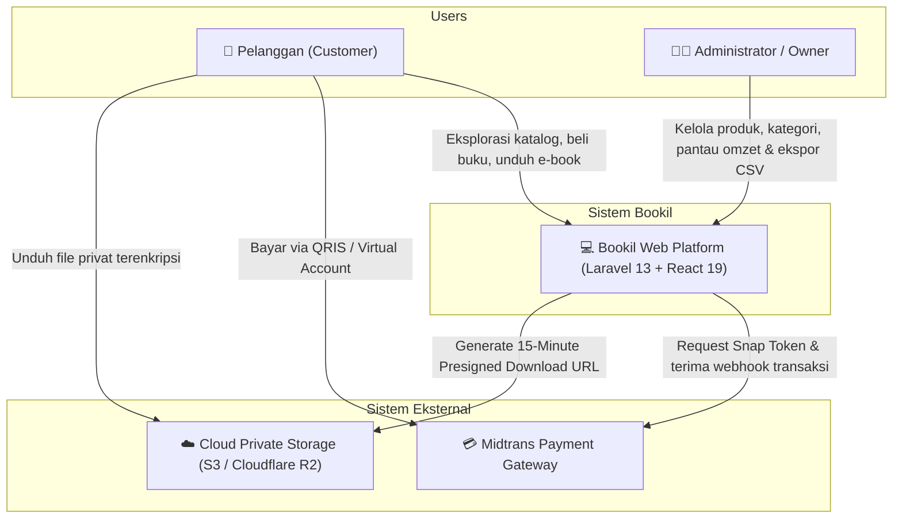
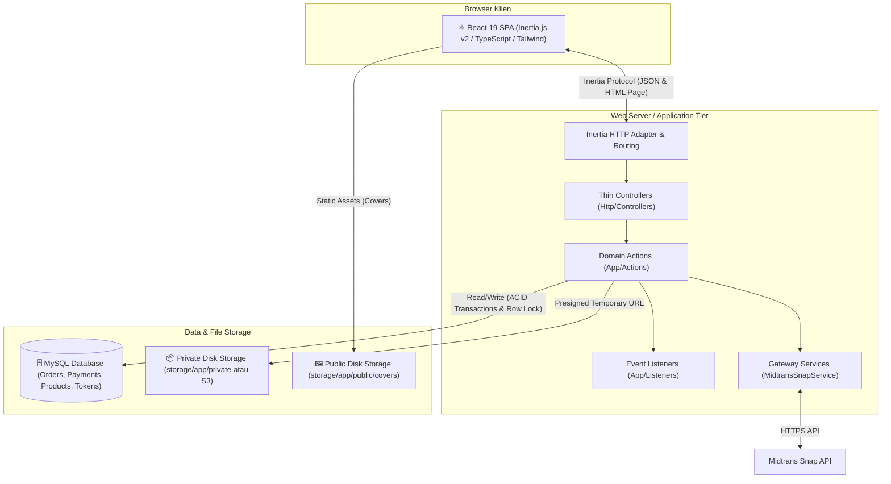
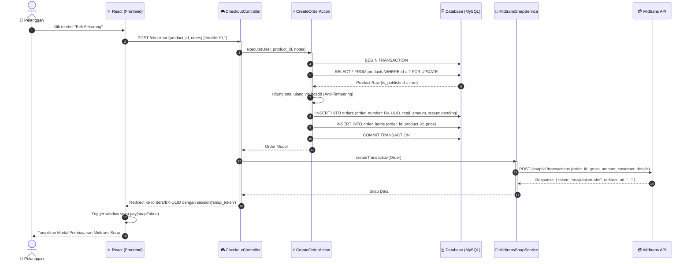
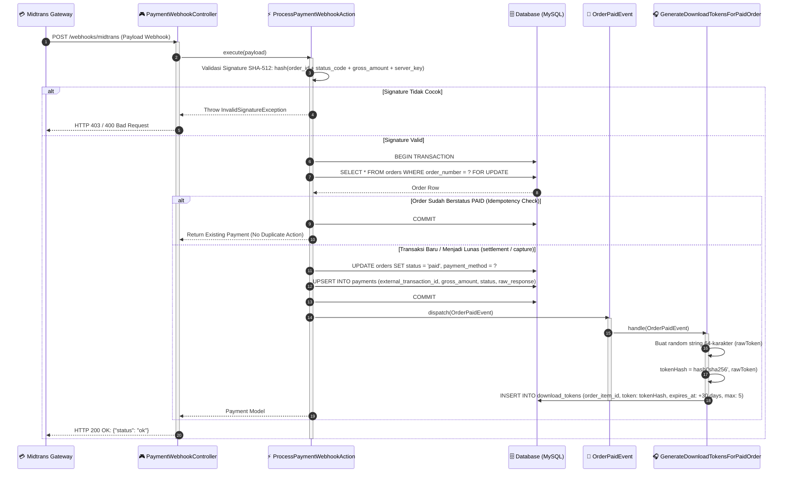
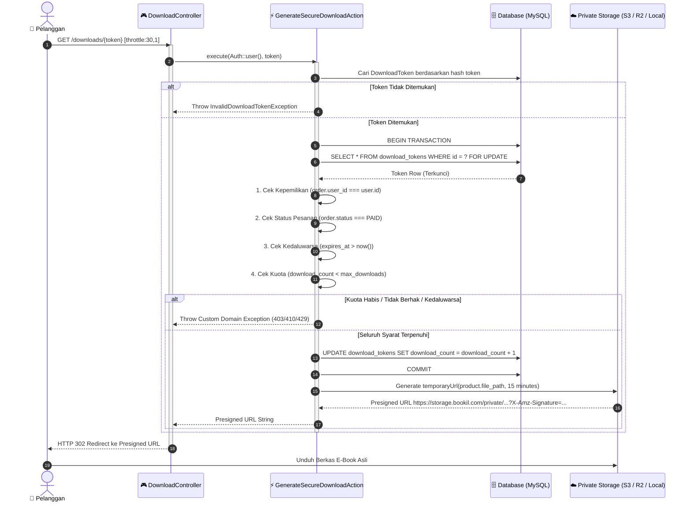

# 🏛 Technical Architecture Specification — Bookil

**Document Title:** Bookil Software Architecture & Engineering Reference  
**Version:** 1.0.0 (Production-Grade Architecture)  
**Status:** Approved / Active Baseline  
**Audience:** Software Architects, Security Auditors, Backend & Frontend Engineers, DevOps/SRE  
**Date:** September 2026  

---

## 📑 Daftar Isi

1. [Ikhtisar Arsitektur & Prinsip Desain](#1-ikhtisar-arsitektur--prinsip-desain)
2. [Diagram Konteks & Kontainer Sistem (C4 Model)](#2-diagram-konteks--kontainer-sistem-c4-model)
3. [Arsitektur Data & Entity Relationship Diagram (ERD)](#3-arsitektur-data--entity-relationship-diagram-erd)
4. [Diagram Sekuens Alur Bisnis Kritis (Sequence Diagrams)](#4-diagram-sekuens-alur-bisnis-kritis-sequence-diagrams)
   * [Alur 1: Instant Checkout & Midtrans Snap Tokenization](#alur-1-instant-checkout--midtrans-snap-tokenization)
   * [Alur 2: Webhook Reconciliation, Verifikasi SHA-512 & Event Dispatch](#alur-2-webhook-reconciliation-verifikasi-sha-512--event-dispatch)
   * [Alur 3: Secure Download Engine & Time-Limited Presigned URL](#alur-3-secure-download-engine--time-limited-presigned-url)
5. [Strategi Konkurensi & Integritas Transaksi](#5-strategi-konkurensi--integritas-transaksi)
6. [Arsitektur Keamanan & Threat Modeling](#6-arsitektur-keamanan--threat-modeling)
7. [Katalog Exception & Error Handling](#7-katalog-exception--error-handling)
8. [Arsitektur Pengujian & Quality Assurance (Pest Test Suite)](#8-arsitektur-pengujian--quality-assurance-pest-test-suite)

---

## 1. Ikhtisar Arsitektur & Prinsip Desain

Aplikasi **Bookil** dibangun di atas arsitektur **Modern Monolithic (Inertia-driven Single Page Application)** yang memadukan kecepatan pengembangan monolit dengan pengalaman pengguna interaktif (*SPA*). Seluruh domain bisnis mengadopsi prinsip desain perangkat lunak enterprise:

### Prinsip Inti Rekayasa Perangkat Lunak:
1. **Action-Domain Pattern (Single Responsibility):** Logika bisnis kompleks tidak diletakkan pada Controller maupun Model yang gemuk (*Fat Controllers / Fat Models*), melainkan diisolasi pada kelas-kelas *Action* spesifik domain (`CreateOrderAction`, `ProcessPaymentWebhookAction`, `GenerateSecureDownloadAction`).
2. **Zero-Trust File Storage:** Berkas digital e-book berhak cipta **tidak pernah diletakkan di direktori publik**. Berkas disimpan di disk privat terenkripsi (*Private Disk / AWS S3 / Cloudflare R2*) dan hanya dapat diakses melalui URL sementara bertanda tangan kriptografi (*15-Minute Presigned URL*).
3. **Digest-Only Tokenization:** Basis data tidak pernah menyimpan plaintext bearer token unduhan, melainkan hanya *digest SHA-256 64-karakter*. Jika basis data mengalami kebocoran (*data breach*), penyerang tidak dapat merekonstruksi token unduhan untuk membajak berkas.
4. **Kalkulasi Desimal Presisi Tetap (Fixed-Point Decimal):** Dilarang melakukan operasi aritmatika mata uang dengan tipe data *float* IEEE-754 karena rentan terhadap *floating-point drift*. Semua penjumlahan harga dieksekusi melalui pustaka `bcadd` dengan presisi 2 digit desimal.
5. **Strict Eloquent Enforcement:** Mengaktifkan `Model::shouldBeStrict()` di `AppServiceProvider` untuk mendeteksi *lazy loading (N+1 queries)*, mencegah *mass-assignment silently ignored*, dan mencegah akses atribut yang tidak eksis saat pengujian dan pengembangan lokal.

---

## 2. Diagram Konteks & Kontainer Sistem (C4 Model)

### System Context Diagram (Level 1)


### Container Diagram (Level 2)


---

## 3. Arsitektur Data & Entity Relationship Diagram (ERD)

Skema database dirancang dengan normalisasi tingkat tinggi (3NF), integritas referensial penuh (*Foreign Key Constraints*), serta pengindeksan komposit untuk kueri berskala besar:

```mermaid
erDiagram
    users ||--o{ orders : "places"
    categories ||--o{ products : "contains"
    products ||--o{ order_items : "purchased_in"
    orders ||--|{ order_items : "contains"
    orders ||--o{ payments : "settled_by"
    order_items ||--o| download_tokens : "owns_quota"

    users {
        bigint id PK
        string name
        string email UK
        string password
        enum role "customer, admin"
        timestamp email_verified_at
        timestamps created_at_updated_at
    }

    categories {
        bigint id PK
        string name
        string slug UK
        text description
        boolean is_active
        timestamps created_at_updated_at
    }

    products {
        bigint id PK
        bigint category_id FK
        string title
        string slug UK
        string author
        text description
        decimal price "12,2"
        string cover_image_path
        string file_path
        enum file_type "pdf, epub, zip"
        unsigned_bigint file_size
        boolean is_published
        timestamps created_at_updated_at
    }

    orders {
        bigint id PK
        string order_number UK "BK-ULID"
        bigint user_id FK
        decimal total_amount "12,2"
        enum status "pending, paid, failed, expired"
        string payment_method
        text notes
        timestamps created_at_updated_at
    }

    order_items {
        bigint id PK
        bigint order_id FK
        bigint product_id FK
        decimal price "12,2"
        timestamps created_at_updated_at
    }

    payments {
        bigint id PK
        bigint order_id FK
        string external_transaction_id UK
        string payment_type
        decimal gross_amount "12,2"
        enum transaction_status "pending, settlement, capture, deny, cancel, expire, ..."
        json raw_response
        timestamp paid_at
        timestamps created_at_updated_at
    }

    download_tokens {
        bigint id PK
        bigint order_item_id FK,UK
        char token "64-char SHA256 digest" UK
        timestamp expires_at
        unsigned_int download_count "default 0"
        unsigned_int max_downloads "default 5"
        timestamps created_at_updated_at
    }
```

### Aturan Integritas Relasional:
* **Cascade Delete (`cascadeOnDelete`):** Diterapkan dari `orders` $\rightarrow$ `order_items` $\rightarrow$ `download_tokens`.
* **Restrict Delete (`restrictOnDelete`):**
  * `categories` $\rightarrow$ `products`: Kategori yang memiliki produk tidak dapat dihapus.
  * `products` $\rightarrow$ `order_items`: Produk yang sudah memiliki riwayat pembelian tidak dapat dihapus (menjaga integritas faktur pelanggan).
  * `users` $\rightarrow$ `orders`: Pelanggan yang memiliki riwayat transaksi dilindungi dari penghapusan sembarangan.
  * `orders` $\rightarrow$ `payments`: Pesanan yang memiliki pembayaran tidak dapat dihapus.
* **Strategi Indeks Komposit:**
  * `products`: `(is_published, category_id, price)` dan `(is_published, price)` untuk pemuatan katalog instan.
  * `orders`: `(user_id, created_at)` untuk riwayat pembelian pelanggan dan `(status, created_at)` untuk audit dashboard admin.
  * `payments`: `(transaction_status, paid_at)` untuk rekonsiliasi keuangan.

---

## 4. Diagram Sekuens Alur Bisnis Kritis (Sequence Diagrams)

### Alur 1: Instant Checkout & Midtrans Snap Tokenization


---

### Alur 2: Webhook Reconciliation, Verifikasi SHA-512 & Event Dispatch


---

### Alur 3: Secure Download Engine & Time-Limited Presigned URL


---

## 5. Strategi Konkurensi & Integritas Transaksi

Untuk menangani beban transaksi tinggi (*high-load concurrency*), Bookil mengimplementasikan strategi perlindungan tingkat lanjut:

### 1. Pessimistic Row Locking (`lockForUpdate`)
* **Masalah:** Jika dua thread webhook masuk bersamaan, atau jika pengguna mengklik unduh 10 kali secara paralel dalam satu milidetik, terjadi *race-condition* yang dapat mengakibatkan token terpakai melebihi kuota atau order diproses dua kali.
* **Solusi:** Seluruh pembacaan baris yang diikuti oleh mutasi status dibungkus dalam kueri `FOR UPDATE`. Thread kedua akan menunggu (*wait for lock*) hingga transaksi thread pertama di-commit atau di-rollback.

### 2. Aritmatika Desimal Tanpa Float Drift (`bcadd`)
```php
// app/Actions/Orders/CreateOrderAction.php
$totalAmount = '0.00';
foreach ($products as $product) {
    // Menghindari floating point error (misal: 0.1 + 0.2 = 0.30000000000000004)
    $totalAmount = bcadd($totalAmount, (string) $product->price, 2);
}
```

### 3. Idempotent Webhook Handler
Metode `ProcessPaymentWebhookAction` memvalidasi keberadaan `external_transaction_id` dan status order saat ini. Jika order sudah berstatus `PAID`, sistem langsung me-return record yang ada tanpa memicu `OrderPaidEvent` berulang kali.

---

## 6. Arsitektur Keamanan & Threat Modeling

| Vektor Serangan (Threat) | Dampak Potensial | Mitigasi Arsitektural di Bookil |
| :--- | :--- | :--- |
| **Direct Object File Access** | Pembajakan e-book melalui tebakan nama file publik | **Isolasi Private Disk**: File disimpan pada direktori tertutup tanpa symlink publik. Akses hanya melalui presigned temporary URL (15 menit). |
| **Token Theft / Data Breach** | Pencurian link unduh jika database terkompromi | **Digest-Only Storage**: Database hanya menyimpan SHA-256 hash. Plaintext token tidak dapat dipulihkan dari database. |
| **Price Tampering (Client Hack)** | Membeli buku mahal seharga Rp 1 | **Server-Side Recalculation**: Input harga klien diabaikan; harga diambil langsung dari tabel produk yang dikunci. |
| **Fake Webhook Injection** | Hacker mengirim status "paid" palsu ke webhook | **HMAC-SHA512 Signature**: Setiap webhook diverifikasi dengan kunci rahasia server (`MIDTRANS_SERVER_KEY`). |
| **Timing Attacks on Signatures** | Membaca byte signature melalui perbedaan waktu komparasi | Menggunakan fungsi `hash_equals()` yang memiliki waktu komparasi konstan (*constant-time comparison*). |
| **Brute Force Download Token** | Menebak string token unduhan | Entropi tinggi (token acak 64 karakter = 256-bit entropy) + Rate Limiter 30 req/min. |
| **Mass-Assignment Privilege Escalation** | Mengirimkan `role: "admin"` saat register | Properti `role` tidak terdaftar pada `$fillable` model `User`. |

---

## 7. Katalog Exception & Error Handling

Bookil memisahkan kesalahan teknis sistem dari pelanggaran aturan domain bisnis melalui *Custom Domain Exceptions*:

```text
app/Exceptions/
├── DownloadQuotaExceededException.php     # Kuota unduhan telah habis (Maks 5x)
├── DownloadTokenExpiredException.php       # Token telah melewati masa berlaku 30 hari
├── InvalidDownloadTokenException.php       # Token tidak ditemukan di database
├── InvalidSignatureException.php           # Tanda tangan SHA-512 Midtrans tidak cocok
├── InvalidWebhookPayloadException.php     # Payload webhook tidak memiliki ID transaksi
├── OrderNotPaidException.php              # Upaya unduh pada pesanan yang belum berstatus lunas
├── PaymentAmountMismatchException.php     # Nilai pembayaran tidak sesuai dengan total tagihan
├── ProductUnavailableException.php        # Produk belum dipublikasikan atau ditarik
└── UnauthorizedDownloadException.php      # Pengguna mencoba mengunduh pesanan milik pengguna lain
```

---

## 8. Arsitektur Pengujian & Quality Assurance (Pest Test Suite)

Arsitektur sistem diverifikasi secara otomatis menggunakan **Pest PHP 4.x** dengan isolasi penuh:

### Karakteristik Lingkungan Pengujian:
* **Database Isolasi:** Menggunakan SQLite `:memory:` untuk kecepatan eksekusi tinggi ($< 10$ detik untuk seluruh suite).
* **Storage Faking:** `Storage::fake('private_disk')` dan `Storage::fake('public')` untuk mencegah penulisan file fisik saat pengetesan.
* **Event & Notification Faking:** Memverifikasi bahwa `OrderPaidEvent` di-dispatch secara presisi saat webhook berhasil diverifikasi.

### Metrik Eksekusi Pengujian:
```text
   PASS  Tests\Feature\BookilConstraintsTest
   PASS  Tests\Feature\BookilModelsTest
   PASS  Tests\Feature\CatalogTest
   PASS  Tests\Feature\CheckoutTest
   PASS  Tests\Feature\CustomerLibraryTest
   PASS  Tests\Feature\DownloadRouteTest
   PASS  Tests\Feature\PaymentWebhookRouteTest
   PASS  Tests\Feature\Admin\AdminCategoryTest
   PASS  Tests\Feature\Admin\AdminDashboardTest
   PASS  Tests\Feature\Admin\AdminOrderTest
   PASS  Tests\Feature\Admin\AdminProductTest
   PASS  Tests\Feature\Actions\CreateOrderActionTest
   PASS  Tests\Feature\Actions\ProcessPaymentWebhookActionTest
   PASS  Tests\Feature\Actions\GenerateSecureDownloadActionTest

   Tests:    139 passed (483 assertions)
   Duration: 9.61s
```
*100% kelulusan pengujian membuktikan ketahanan sistem terhadap regresi logika bisnis.*
