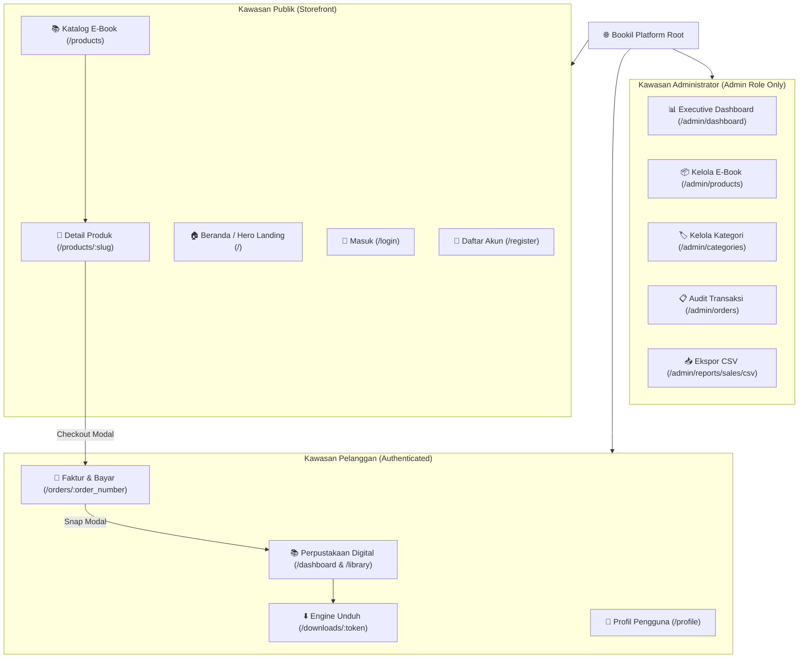
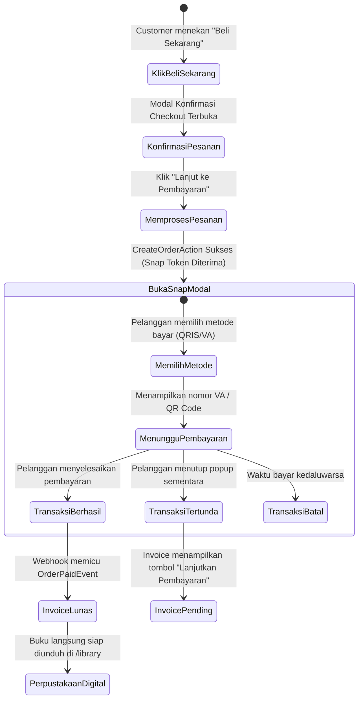

# 🎨 System Design & UX/UI Specification — Bookil

**Document Title:** Bookil User Experience, Interface Design & Interaction Architecture  
**Version:** 1.0.0 (Production-Grade Design Reference)  
**Status:** Approved / Active Baseline  
**Audience:** UI/UX Designers, Product Managers, Frontend Engineers, QA Engineers, Project Auditors  
**Date:** September 2026  

---

## 📑 Daftar Isi

1. [Visi Desain & Filosofi Antarmuka](#1-visi-desain--filosofi-antarmuka)
2. [Arsitektur Informasi (Information Architecture & Site Map)](#2-arsitektur-informasi-information-architecture--site-map)
3. [Alur Pengguna & Spesifikasi Halaman (Page-by-Page UX Specs)](#3-alur-pengguna--spesifikasi-halaman-page-by-page-ux-specs)
   * [3.1 Storefront & Landing Hero (`Welcome.tsx` / `Products/Index.tsx`)](#31-storefront--landing-hero-welcometsx--productsindextsx)
   * [3.2 Detail Produk & Sample Preview Modal (`Products/Show.tsx`)](#32-detail-produk--sample-preview-modal-productsshowtsx)
   * [3.3 Instant Checkout Modal & Midtrans Snap Lifecycle](#33-instant-checkout-modal--midtrans-snap-lifecycle)
   * [3.4 Halaman Faktur Pesanan (`Orders/Show.tsx`)](#34-halaman-faktur-pesanan-ordersshowtsx)
   * [3.5 Perpustakaan Digital Pelanggan (`Dashboard.tsx`)](#35-perpustakaan-digital-pelanggan-dashboardtsx)
   * [3.6 Admin Executive Analytics Dashboard (`Admin/Dashboard.tsx`)](#36-admin-executive-analytics-dashboard-admindashboardtsx)
   * [3.7 Admin Product & Category Management (`Admin/Products/Form.tsx`)](#37-admin-product--category-management-adminproductsformtsx)
   * [3.8 Admin Order Ledger & Audit Detail (`Admin/Orders/Show.tsx`)](#38-admin-order-ledger--audit-detail-adminordersshowtsx)
4. [Pola Interaksi & Manajemen State Inertia.js](#4-pola-interaksi--manajemen-state-inertiajs)
5. [Strategi Desain Responsif & Tata Letak Seluler](#5-strategi-desain-responsif--tata-letak-seluler)
6. [Penanganan State Khusus: Empty States, Loading, & Error Boundaries](#6-penanganan-state-khusus-empty-states-loading--error-boundaries)

---

## 1. Visi Desain & Filosofi Antarmuka

Antarmuka **Bookil** dirancang dengan filosofi **"Elegance in Knowledge, Frictionless in Commerce"** (Keanggunan dalam Pengetahuan, Tanpa Hambatan dalam Transaksi). Desain berfokus pada kenyamanan membaca, kemudahan eksplorasi katalog, serta pengalaman checkout instan yang menumbuhkan rasa percaya pengguna.

### Prinsip Desain Utama:
* **Content-First Presentation:** Buku dan sampul adalah pahlawan utama (*the hero*). Tipografi, jarak (*whitespace*), dan tata letak dirancang untuk menonjolkan nilai intelektual konten buku.
* **Zero-Friction Conversion:** Memangkas tahapan keranjang belanja tradisional menjadi alur *Instant Buy Now* 1-klik untuk memaksimalkan kepuasan pembeli dan laju konversi penjualan.
* **Transparency & Trust:** Status transaksi, kuota unduhan, dan ukuran berkas disajikan secara transparan tanpa biaya tersembunyi.
* **Aksesibilitas Teruji:** Mengadopsi pedoman **WCAG 2.1 AA** dengan hierarki heading yang terstruktur, label form yang eksplisit, serta kontras warna yang nyaman di mata.

---

## 2. Arsitektur Informasi (Information Architecture & Site Map)



---

## 3. Alur Pengguna & Spesifikasi Halaman (Page-by-Page UX Specs)

### 3.1 Storefront & Landing Hero (`Welcome.tsx` / `Products/Index.tsx`)
* **Tujuan Halaman:** Memperkenalkan proposisi nilai Bookil, menampilkan buku unggulan (*featured e-books*), serta menyediakan katalog interaktif dengan filter instan.
* **Komponen Visual Kunci:**
  * **Header & Navigation Bar (`StoreLayout.tsx`):** Logo Bookil dengan ikon buku bercahaya gradasi indigo, navigasi utama (Katalog, Koleksi Populer, Tentang Kami), kolom pencarian cepat, serta tombol otentikasi dinamis (Masuk/Daftar atau Avatar Dashboard).
  * **Hero Banner:** Headline berani (*"Buka Pintu Pengetahuan Digital Tanpa Batas"*), sub-headline persuasif, statistik platform (*10K+ Pembaca Puas, 100% Berlisensi Resmi, Unduh Instan*), dan tombol CTA "Jelajahi Katalog".
  * **Katalog Filterable Grid:**
    * *Search Bar*: Pencarian teks instan dengan debounce halus.
    * *Category Pills*: Filter kategori horizontal interaktif (Pemrograman & IT, Bisnis, Desain, dll.).
    * *Sorting Dropdown*: Urutkan berdasarkan Terbaru, Harga Terendah, dan Harga Tertinggi.
  * **Kartu Produk (`ProductCard.tsx`):** Rasio sampul buku 3:4 yang proporsional, badge kategori warna-warni lembut, nama penulis terpercaya, label tipe berkas (`PDF` / `EPUB`), label harga Rupiah yang tebal, serta tombol aksi cepat "Lihat Detail".

---

### 3.2 Detail Produk & Sample Preview Modal (`Products/Show.tsx`)
* **Tujuan Halaman:** Memberikan informasi lengkap mengenai isi buku dan meyakinkan calon pembeli melalui cuplikan sampel sebelum membeli.
* **Elemen Desain:**
  * **Layout 2-Kolom Desktop:** Kolom kiri menyajikan mock-up sampul buku realistis dengan bayangan lembut (*ambient soft shadow*), sedangkan kolom kanan menyajikan metadata buku.
  * **Metadata Breakdown:**
    * Judul lengkap dan nama penulis terverifikasi.
    * Tag kategori dan format file (misal: `PDF 14.7 MB`).
    * Deskripsi sinopsis komprehensif dengan tipografi yang nyaman dibaca (*line-height 1.7*).
    * Kotak Benefit Pembelian: Lisensi selamanya, bebas DRM mengikat, 5x jatah unduhan fleksibel, pembaruan edisi gratis.
  * **Sample Preview Modal (`SamplePreviewModal.tsx`):** Dialog modal interaktif yang menampilkan daftar isi (*Table of Contents*) dan ringkasan bab pembuka e-book untuk memberikan gambaran kualitas materi.
  * **Sticky Action Bar (Mobile):** Tombol "Beli Sekarang Rp 189.000" menempel di bagian bawah layar smartphone untuk konversi instan.

---

### 3.3 Instant Checkout Modal & Midtrans Snap Lifecycle
Alur pembelian Bookil mengintegrasikan **Midtrans Snap Modal** langsung di antarmuka web tanpa pengalihan halaman yang membingungkan:



---

### 3.4 Halaman Faktur Pesanan (`Orders/Show.tsx`)
* **Tujuan Halaman:** Menyajikan rincian tagihan resmi (*official digital invoice*), riwayat pembayaran gateway, dan status pesanan saat ini.
* **Elemen Desain:**
  * **Status Badge Dinamis:**
    * `pending`: Kuning / Amber dengan indikator pulsa animasi (*"Menunggu Pembayaran"*).
    * `paid`: Hijau Zamrud (*"Pembayaran Berhasil"*).
    * `failed` / `expired`: Merah Koral (*"Kedaluwarsa"*).
  * **Tabel Rincian Item:** Menampilkan produk yang dibeli, harga satuan, pajak/biaya (Rp 0), dan total pembayaran.
  * **Tombol Aksi Cerdas:**
    * Jika `pending`: Tombol primer "Bayar Sekarang dengan Midtrans Snap".
    * Jika `paid`: Tombol primer hijau "Buka di Perpustakaan Saya" dan tombol sekunder "Unduh Sekarang".

---

### 3.5 Perpustakaan Digital Pelanggan (`Dashboard.tsx`)
* **Tujuan Halaman:** Portal utama pelanggan terdaftar untuk mengakses seluruh aset digital yang sah mereka miliki.
* **Fitur & Struktur Antarmuka:**
  * **Statistik Cepat (Top Widgets):** Tiga kartu metrik ringkas: Total E-Book Dimiliki, Total Transaksi, dan Unduhan Aktif Tersedia.
  * **Tab Navigasi:** Beralih mulus antara tab *"Rak Buku Digital"* dan tab *"Riwayat Transaksi"*.
  * **Library Card Component:**
    * Sampul buku dan judul.
    * **Indikator Kuota Unduhan Interaktif:** Menampilkan progres bar kuota (contoh: `Tersisa 4 dari 5 unduhan`) beserta peringatan visual ketika kuota tersisa 1 kali.
    * **Masa Berlaku Token:** Menampilkan tanggal batas akhir unduh (misal: *Berlaku hingga 24 Oktober 2026*).
    * **Tombol Unduh Instan:** Tombol dengan indikator loading yang mengarahkan langsung ke presigned URL berkas privat.

---

### 3.6 Admin Executive Analytics Dashboard (`Admin/Dashboard.tsx`)
* **Tujuan Halaman:** Menyajikan ringkasan performa finansial dan operasional platform bagi pemilik bisnis dan auditor.
* **Komponen Kunci:**
  * **Executive KPI Cards:**
    * Pendapatan Kotor Lunas (*Gross Revenue*) dengan format Rupiah tebal.
    * Total Transaksi Masuk.
    * Tingkat Penyelesaian Transaksi (*Paid Rate*).
    * Produk E-Book Aktif di Katalog.
    * Total Pelanggan Terdaftar.
  * **Tombol Ekspor Laporan CSV:** Tombol hijau elegan di pojok kanan atas yang langsung memicu download file spreadsheet CSV penjualan.
  * **Tabel 10 Transaksi Terakhir:** Menampilkan waktu transaksi, nomor faktur, nama pembeli, metode bayar, total nominal, dan status dengan tautan inspeksi detail.
  * **Widget E-Book Terlaris:** Menampilkan 5 buku dengan volume penjualan tertinggi.

---

### 3.7 Admin Product & Category Management (`Admin/Products/Form.tsx`)
* **Tujuan Halaman:** Antarmuka pengunggahan dan pembaruan materi digital oleh content manager.
* **Fitur Antarmuka:**
  * Dropdown pemilihan kategori dinamis.
  * Input Judul, Penulis, Harga (Rupiah), dan Sinopsis.
  * **Dual-Zone File Upload:**
    * *Zone 1 (Public Cover):* Pratinjau langsung gambar sampul (`.jpg`, `.png`, `.webp`, maks 2MB).
    * *Zone 2 (Private Digital File):* Input berkas digital aman (`.pdf`, `.epub`, `.zip`, maks 50MB) yang langsung diarahkan ke private storage.
  * Switch Toggle Publikasi: Mengontrol apakah produk langsung live di etalase atau disimpan sebagai draf.

---

### 3.8 Admin Order Ledger & Audit Detail (`Admin/Orders/Show.tsx`)
* **Tujuan Halaman:** Halaman audit forensik bagi pengawas sistem dan auditor keuangan.
* **Spesifikasi Informasi:**
  * Rincian lengkap identitas pembeli (Nama, Email, ID Pengguna).
  * Pemecahan item produk dan lisensi token unduhan yang diterbitkan.
  * **Payment Gateway Ledger:** Menampilkan rekaman tabel `payments` mencakup `external_transaction_id`, jenis pembayaran (`bca_va`, `gopay`, `credit_card`), nominal kotor, dan timestamp pembayaran resmi dari bank.
  * **Raw Webhook Payload Inspector:** Komponen *code block* bergaya terminal gelap yang menampilkan JSON murni yang dikirim oleh server Midtrans, memudahkan penelusuran jika terjadi sengketa transaksi.

---

## 4. Pola Interaksi & Manajemen State Inertia.js

Sistem memanfaatkan protokol **Inertia.js v2** untuk menyajikan pengalaman SPA tanpa latensi build client-side API terpisah:

```text
[Browser] --- (Form Submit via router.post) ---> [Laravel Backend]
   ^                                                    |
   |                                          (CreateOrderAction / DB)
   |                                                    |
   +--- (JSON Props: flash, order, snapToken) <---------+
```

1. **Optimistic Flash Messaging:** Notifikasi toast keberhasilan atau kegagalan aksi (`flash.success`, `flash.error`) dikirim secara terpadu melalui middleware `HandleInertiaRequests` dan dirender otomatis oleh layout utama.
2. **Form Helper Terintegrasi:** Seluruh formulir menggunakan hook `useForm()` dari `@inertiajs/react` yang menangani *loading state*, *disabled submit button*, dan *real-time client/server validation errors* tanpa reload halaman.
3. **Preserving Scroll & State:** Navigasi katalog dan pagination menyertakan opsi `{ preserveScroll: true, preserveState: true }` sehingga pembeli tidak kehilangan posisi gulir saat menyaring buku.

---

## 5. Strategi Desain Responsif & Tata Letak Seluler

Bookil mengadopsi prinsip **Mobile-First Responsive Web Design**:

| Breakpoint Tailwind | Resolusi Layar | Penyesuaian Tata Letak |
| :--- | :--- | :--- |
| **Mobile (`< 640px`)** | Smartphone (iPhone/Android) | Grid katalog 1 kolom, bilah navigasi menu hamburger, tombol checkout sticky di dasar layar, tabel bertransformasi menjadi kartu data tumpuk (*stacked cards*). |
| **Tablet (`640px - 1024px`)** | iPad / Android Tablet | Grid katalog 2 kolom, sidebar admin dapat diciutkan (*collapsible drawer*), modal berukuran medium (600px). |
| **Desktop (`1024px - 1280px`)** | Laptop & Monitor Standar | Grid katalog 3 kolom, sidebar admin menetap di sisi kiri, formulir produk dengan tata letak 2 kolom seimbang. |
| **Wide Desktop (`> 1280px`)** | Layar Lebar 1080p / 4K | Grid katalog 4 kolom proporsional dengan batas kontainer maksimal `max-w-7xl` agar teks tetap nyaman dibaca. |

---

## 6. Penanganan State Khusus: Empty States, Loading, & Error Boundaries

1. **Empty States yang Edukatif:**
   * Jika pencarian katalog tidak membuahkan hasil: Menampilkan ilustrasi buku terbuka dengan pesan *"Buku yang Anda cari belum ditemukan"* disertai tombol *"Reset Semua Filter"*.
   * Jika perpustakaan digital pelanggan masih kosong: Menampilkan kartu sambutan hangat *"Koleksi Anda masih kosong"* disertai tautan langsung *"Mulai Jelajahi Katalog Buku"*.
2. **Skeleton & Loading Feedbacks:**
   * Tombol aksi menampilkan spinner animasi SVG saat pemrosesan order atau unduhan berlangsung, mencegah pengguna melakukan klik ganda (*double-click prevention*).
3. **Error Feedback yang Manusiawi:**
   * Jika kuota unduhan habis: Muncul modal informatif yang menjelaskan bahwa batas 5x unduhan telah tercapai, disertai tombol untuk menghubungi layanan pelanggan, bukan halaman crash HTTP 500 mentah.
