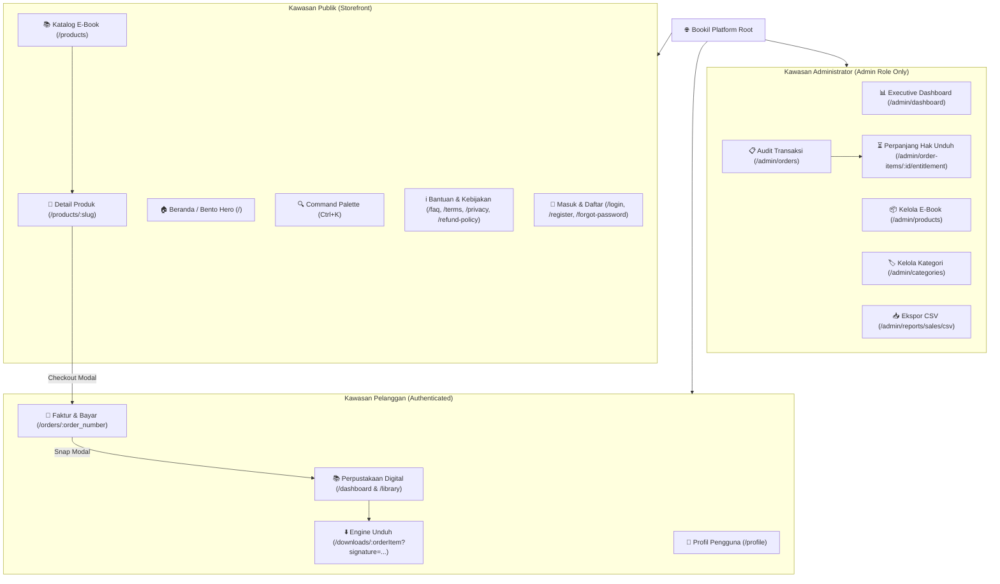
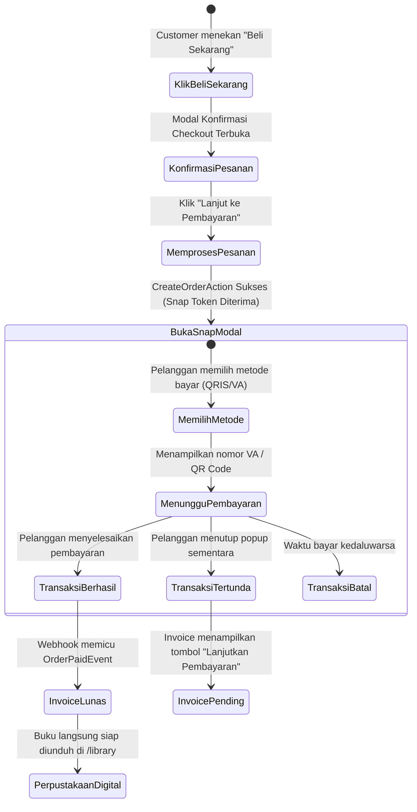

# 🎨 System Design & UX/UI Specification — Bookil

**Document Title:** Bookil User Experience, Interface Design & Interaction Architecture  
**Version:** 1.1.0 (Production-Grade Design Reference)  
**Status:** Approved / Active Baseline  
**Audience:** UI/UX Designers, Product Managers, Frontend Engineers, QA Engineers, Technical Reviewers  
**Date:** September 2026  

---

## 📑 Daftar Isi

1. [Visi Desain & Filosofi Antarmuka](#1-visi-desain--filosofi-antarmuka)
2. [Arsitektur Informasi (Information Architecture & Site Map)](#2-arsitektur-informasi-information-architecture--site-map)
3. [Alur Pengguna & Spesifikasi Halaman (Page-by-Page UX Specs)](#3-alur-pengguna--spesifikasi-halaman-page-by-page-ux-specs)
   * [3.1 Storefront & Bento Hero (`Welcome.tsx` / `Products/Index.tsx`)](#31-storefront--bento-hero-welcometsx--productsindextsx)
   * [3.2 Quick Search & Command Palette (`CommandPalette.tsx` / `Ctrl+K`)](#32-quick-search--command-palette-commandpalettetsx--ctrlk)
   * [3.3 Detail Produk & Sample Preview Modal (`Products/Show.tsx`)](#33-detail-produk--sample-preview-modal-productsshowtsx)
   * [3.4 Instant Checkout Modal & Midtrans Snap Lifecycle](#34-instant-checkout-modal--midtrans-snap-lifecycle)
   * [3.5 Halaman Faktur Pesanan (`Orders/Show.tsx`)](#35-halaman-faktur-pesanan-ordersshowtsx)
   * [3.6 Perpustakaan Digital Pelanggan (`Dashboard.tsx`)](#36-perpustakaan-digital-pelanggan-dashboardtsx)
   * [3.7 Admin Executive Analytics Dashboard (`Admin/Dashboard.tsx`)](#37-admin-executive-analytics-dashboard-admindashboardtsx)
   * [3.8 Admin Product & Category Management (`Admin/Products/Form.tsx`)](#38-admin-product--category-management-adminproductsformtsx)
   * [3.9 Admin Order Ledger & Entitlement Extension (`Admin/Orders/Show.tsx`)](#39-admin-order-ledger--entitlement-extension-adminordersshowtsx)
4. [Pola Interaksi & Manajemen State Inertia.js v2](#4-pola-interaksi--manajemen-state-inertiajs-v2)
5. [Strategi Desain Responsif & Validasi Lintas Perangkat](#5-strategi-desain-responsif--validasi-lintas-perangkat)
6. [Penanganan State Khusus: Empty States, Loading, & Error Boundaries](#6-penanganan-state-khusus-empty-states-loading--error-boundaries)

---

## 1. Visi Desain & Filosofi Antarmuka

Antarmuka **Bookil** dirancang dengan filosofi **"Elegance in Knowledge, Frictionless in Commerce"** (Keanggunan dalam Pengetahuan, Tanpa Hambatan dalam Transaksi). Desain berfokus pada kenyamanan membaca, kemudahan eksplorasi katalog, serta pengalaman checkout instan yang menumbuhkan rasa percaya pengguna.

### Prinsip Desain Utama:
* **Content-First Presentation:** Buku dan sampul adalah pahlawan utama (*the hero*). Tipografi, jarak (*whitespace*), dan tata letak dirancang untuk menonjolkan nilai intelektual konten buku.
* **Zero-Friction Conversion:** Memangkas tahapan keranjang belanja multi-langkah tradisional menjadi alur *Instant Buy Now* 1-klik yang langsung memicu pembayaran Midtrans Snap.
* **Transparency & Trust:** Status transaksi, progres kuota unduhan, dan ukuran berkas disajikan secara transparan tanpa biaya tersembunyi.
* **Aksesibilitas Teruji (WCAG 2.1 AA):** Hierarki heading terstruktur, keyboard shortcut global (`Ctrl + K`), label formulir eksplisit, dan kontras warna teks terhadap background minimal 4.5:1.

---

## 2. Arsitektur Informasi (Information Architecture & Site Map)


```mermaid
graph TD
    Root["🌐 Bookil Platform Root"]

    subgraph PublicPages ["Kawasan Publik (Storefront)"]
        Home["🏠 Beranda / Bento Hero (/)"]
        Catalog["📚 Katalog E-Book (/products)"]
        ProductDetail["📖 Detail Produk (/products/:slug)"]
        CmdPalette["🔍 Command Palette (Ctrl+K)"]
        SupportPages["ℹ️ Bantuan & Kebijakan (/faq, /terms, /privacy, /refund-policy)"]
        AuthPages["🔑 Masuk & Daftar (/login, /register, /forgot-password)"]
    end

    subgraph CustomerPortal ["Kawasan Pelanggan (Authenticated)"]
        CustDash["📚 Perpustakaan Digital (/dashboard & /library)"]
        Invoice["🧾 Faktur & Bayar (/orders/:order_number)"]
        Download["⬇️ Engine Unduh (/downloads/:orderItem?signature=...)"]
        Profile["👤 Profil Pengguna (/profile)"]
    end

    subgraph AdminPortal ["Kawasan Administrator (Admin Role Only)"]
        AdminDash["📊 Executive Dashboard (/admin/dashboard)"]
        AdminProducts["📦 Kelola E-Book (/admin/products)"]
        AdminCategories["🏷️ Kelola Kategori (/admin/categories)"]
        AdminOrders["📋 Audit Transaksi (/admin/orders)"]
        EntitlementExt["⏳ Perpanjang Hak Unduh (/admin/order-items/:id/entitlement)"]
        CSVExport["📥 Ekspor CSV (/admin/reports/sales/csv)"]
    end

    Root --> PublicPages
    Root --> CustomerPortal
    Root --> AdminPortal

    Catalog --> ProductDetail
    ProductDetail -->|"Checkout Modal"| Invoice
    Invoice -->|"Snap Modal"| CustDash
    CustDash --> Download
    AdminOrders --> EntitlementExt
```

---

## 3. Alur Pengguna & Spesifikasi Halaman (Page-by-Page UX Specs)

### 3.1 Storefront & Bento Hero (`Welcome.tsx` / `Products/Index.tsx`)
* **Tujuan Halaman:** Memperkenalkan proposisi nilai Bookil, menampilkan koleksi unggulan dalam Bento Grid modern, serta menyediakan katalog interaktif dengan filter instan.
* **Komponen Visual Kunci:**
  * **Header & Navigation Bar (`StoreLayout.tsx`):** Logo Bookil dengan ikon buku bercahaya gradasi indigo, navigasi utama (Katalog, Bantuan, FAQ), tombol pencarian cepat dengan badge shortcut `Ctrl + K`, serta status otentikasi dinamis (Masuk/Daftar atau Avatar Dashboard Pelanggan).
  * **Bento Grid Hero Showcase (`BentoHero.tsx`):**
    * Kartu Utama: Headline berani (*"Buka Pintu Pengetahuan Digital Tanpa Batas"*), sub-headline persuasif, dan tombol aksi "Jelajahi Katalog".
    * Kartu Metrik: Statistik platform (*10K+ Pembaca Puas, 100% Berlisensi Resmi, Unduh Instan*).
    * Kartu Jaminan Keamanan: Privasi file Zero-Trust dan garansi transaksi lunas instan.
  * **Katalog Filterable Grid:**
    * *Search Bar*: Pencarian teks instan dengan debounce halus (*case-insensitive* pada title, author, dan description).
    * *Category Pills*: Filter kategori horizontal interaktif (Pemrograman & IT, Bisnis, Desain, dll.).
    * *Sorting Dropdown*: Urutkan berdasarkan Terbaru, Harga Terendah, dan Harga Tertinggi.
  * **Kartu Produk (`ProductCard.tsx`):** Rasio sampul buku 3:4 yang proporsional dengan komponen `BookCoverImage`, badge kategori lembut, nama penulis terpercaya, label format berkas (`PDF` / `EPUB`), label harga Rupiah tebal, dan tombol aksi cepat "Lihat Detail".

---

### 3.2 Quick Search & Command Palette (`CommandPalette.tsx` / `Ctrl+K`)
* **Tujuan:** Memungkinkan pengguna mencari dan melompat ke buku yang diinginkan dalam sekejap tanpa menyentuh mouse.
* **Fitur & Interaksi:**
  * Tekan tombol pintasan `Ctrl + K` (atau `Cmd + K` di macOS) di mana saja pada situs untuk memunculkan modal pencarian mengambang (*floating command palette*).
  * Input pencarian langsung berfokus (*auto-focus*).
  * Mengetik kata kunci menampilkan hasil pencarian real-time dengan sampul mini, judul, penulis, dan harga.
  * Navigasi hasil menggunakan tombol panah atas/bawah dan tekan `Enter` untuk langsung membuka halaman detail buku.

---

### 3.3 Detail Produk & Sample Preview Modal (`Products/Show.tsx`)
* **Tujuan Halaman:** Memberikan informasi lengkap mengenai isi buku dan meyakinkan calon pembeli melalui cuplikan sampel sebelum membeli.
* **Elemen Desain:**
  * **Layout 2-Kolom Desktop:** Kolom kiri menyajikan mock-up sampul buku realistis dengan bayangan lembut (*ambient soft shadow*), sedangkan kolom kanan menyajikan metadata buku.
  * **Metadata Breakdown:**
    * Judul lengkap dan nama penulis terverifikasi.
    * Tag kategori dan format file (contoh: `PDF 14.7 MB` atau ukuran presisi dalam byte/KB).
    * Deskripsi sinopsis komprehensif dengan tipografi yang nyaman dibaca (*line-height 1.7*).
    * Kotak Benefit Pembelian: Lisensi resmi, bebas DRM mengikat, jatah 5x unduhan fleksibel, masa aktif 30 hari.
  * **Sample Preview Modal (`SamplePreviewModal.tsx`):** Dialog modal interaktif yang menampilkan daftar isi (*Table of Contents*) dan ringkasan bab pembuka e-book untuk memberikan gambaran kualitas materi.
  * **Sticky Action Bar (Mobile):** Tombol "Beli Sekarang Rp 189.000" menempel di bagian bawah layar smartphone untuk konversi instan.

---

### 3.4 Instant Checkout Modal & Midtrans Snap Lifecycle
Alur pembelian Bookil mengintegrasikan **Midtrans Snap Modal** langsung di antarmuka web tanpa pengalihan halaman yang membingungkan:


```mermaid
stateDiagram-v2
    [*] --> KlikBeliSekarang: Customer menekan "Beli Sekarang"
    KlikBeliSekarang --> KonfirmasiPesanan: Modal Konfirmasi Checkout Terbuka
    KonfirmasiPesanan --> MemprosesPesanan: Klik "Lanjut ke Pembayaran"
    MemprosesPesanan --> BukaSnapModal: CreateOrderAction Sukses (Snap Token Diterima)
    
    state BukaSnapModal {
        [*] --> MemilihMetode: Pelanggan memilih metode bayar (QRIS/VA)
        MemilihMetode --> MenungguPembayaran: Menampilkan nomor VA / QR Code
        MenungguPembayaran --> TransaksiBerhasil: Pelanggan menyelesaikan pembayaran
        MenungguPembayaran --> TransaksiTertunda: Pelanggan menutup popup sementara
        MenungguPembayaran --> TransaksiBatal: Waktu bayar kedaluwarsa
    }

    TransaksiBerhasil --> InvoiceLunas: Webhook memicu OrderPaidEvent
    InvoiceLunas --> PerpustakaanDigital: Buku langsung siap diunduh di /library
    TransaksiTertunda --> InvoicePending: Invoice menampilkan tombol "Lanjutkan Pembayaran"
```

---

### 3.5 Halaman Faktur Pesanan (`Orders/Show.tsx`)
* **Tujuan Halaman:** Menyajikan rincian tagihan resmi (*official digital invoice*), riwayat pembayaran gateway, dan status pesanan saat ini.
* **Elemen Desain:**
  * **Status Badge Dinamis (`StatusBadge.tsx`):**
    * `pending`: Kuning / Amber dengan indikator pulsa animasi (*"Menunggu Pembayaran"*).
    * `paid`: Hijau Zamrud (*"Pembayaran Berhasil"*).
    * `failed` / `expired`: Merah Koral (*"Kedaluwarsa"*).
  * **Tabel Rincian Item:** Menampilkan produk yang dibeli, harga satuan, pajak/biaya (Rp 0), dan total pembayaran.
  * **Tombol Aksi Cerdas:**
    * Jika `pending`: Tombol primer "Bayar Sekarang dengan Midtrans Snap".
    * Jika `paid`: Tombol primer hijau "Buka di Perpustakaan Saya" dan tombol sekunder "Unduh Sekarang".
    * Tombol salin nomor pesanan (*copy to clipboard*) dengan feedback visual.

---

### 3.6 Perpustakaan Digital Pelanggan (`Dashboard.tsx`)
* **Tujuan Halaman:** Portal utama pelanggan terdaftar untuk mengakses seluruh aset digital yang sah mereka miliki.
* **Fitur & Struktur Antarmuka:**
  * **Statistik Cepat (Top Widgets):** Tiga kartu metrik ringkas: Total E-Book Dimiliki, Total Transaksi, dan Unduhan Aktif Tersedia.
  * **Tab Navigasi:** Beralih mulus antara tab *"Rak Buku Digital"* dan tab *"Riwayat Transaksi"*.
  * **Library Card Component:**
    * Sampul buku dan judul.
    * **Indikator Kuota Unduhan Interaktif (`QuotaProgressBar.tsx`):** Menampilkan bar progres kuota (contoh: `Tersisa 4 dari 5 unduhan`) beserta perubahan warna menjadi kuning/merah ketika kuota kritis.
    * **Masa Berlaku Token:** Menampilkan tanggal batas akhir unduh (misal: *Berlaku hingga 29 Oktober 2026*).
    * **Tombol Unduh Instan:** Tombol native bertanda tangan yang mengarahkan langsung ke presigned URL berkas privat.
    * **Badge Status Verifikasi Email:** Indikator visual apakah akun pelanggan sudah terverifikasi email atau belum, tanpa memblokir akses ke rak buku yang sudah dibeli.

---

### 3.7 Admin Executive Analytics Dashboard (`Admin/Dashboard.tsx`)
* **Tujuan Halaman:** Menyajikan ringkasan performa finansial dan operasional platform bagi pemilik bisnis dan auditor.
* **Komponen Kunci:**
  * **Executive KPI Cards:**
    * Pendapatan Kotor Lunas (*Gross Revenue*) dengan format Rupiah tebal.
    * Total Transaksi Masuk.
    * Tingkat Penyelesaian Transaksi (*Paid Rate*).
    * Produk E-Book Aktif di Katalog.
    * Total Pelanggan Terdaftar.
  * **Tombol Ekspor Laporan CSV:** Tombol hijau elegan di pojok kanan atas yang langsung memicu download file spreadsheet CSV penjualan dengan enkripsi UTF-8 BOM.
  * **Tabel 10 Transaksi Terakhir:** Menampilkan waktu transaksi, nomor faktur, nama pembeli, metode bayar, total nominal, dan status dengan tautan inspeksi detail.
  * **Widget E-Book Terlaris:** Menampilkan 5 buku dengan volume penjualan tertinggi.

---

### 3.8 Admin Product & Category Management (`Admin/Products/Form.tsx`)
* **Tujuan Halaman:** Antarmuka pengunggahan dan pembaruan materi digital oleh content manager.
* **Fitur Antarmuka:**
  * Dropdown pemilihan kategori dinamis.
  * Input Judul, Penulis, Harga (Rupiah), dan Sinopsis.
  * **Dual-Zone File Upload:**
    * *Zone 1 (Public Cover):* Pratinjau langsung gambar sampul (`.jpg`, `.png`, `.webp`, maks 2MB).
    * *Zone 2 (Private Digital File):* Input berkas digital aman (`.pdf`, `.epub`, `.zip`, maks 50MB) yang langsung diarahkan ke private storage.
  * Switch Toggle Publikasi: Mengontrol apakah produk langsung live di etalase atau disimpan sebagai draf.

---

### 3.9 Admin Order Ledger & Entitlement Extension (`Admin/Orders/Show.tsx`)
* **Tujuan Halaman:** Halaman audit forensik bagi pengawas sistem dan auditor keuangan, serta pengelolaan hak unduh darurat.
* **Spesifikasi Informasi:**
  * Rincian lengkap identitas pembeli (Nama, Email, ID Pengguna).
  * Pemecahan item produk dan lisensi token unduhan yang diterbitkan.
  * **Payment Gateway Ledger:** Menampilkan rekaman tabel `payments` mencakup `external_transaction_id`, jenis pembayaran (`bca_va`, `gopay`, `credit_card`), nominal kotor, dan timestamp pembayaran resmi dari bank.
  * **Raw Webhook Payload Inspector:** Komponen *code block* bergaya terminal gelap yang menampilkan JSON murni yang dikirim oleh server Midtrans, memudahkan penelusuran jika terjadi sengketa transaksi.
  * **Entitlement Extension Dialog:** Formulir bagi admin untuk menambahkan kuota unduh (+downloads) atau menambah masa aktif (+hari) disertai alasan wajib (*reason*) yang otomatis dicatat ke tabel `entitlement_extensions`.

---

## 4. Pola Interaksi & Manajemen State Inertia.js v2

Sistem memanfaatkan protokol **Inertia.js v2** untuk menyajikan pengalaman SPA tanpa latensi build client-side API terpisah:

```text
[Browser] --- (Form Submit via router.post) ---> [Laravel Backend]
   ^                                                    |
   |                                          (CreateOrderAction / DB)
   |                                                    |
   +--- (JSON Props: flash, order, snapToken) <---------+
```

1. **Optimistic Flash Messaging:** Notifikasi toast keberhasilan atau kegagalan aksi (`flash.success`, `flash.error`) dikirim secara terpadu melalui middleware `HandleInertiaRequests` dan dirender otomatis oleh layout utama.
2. **Form Helper Terintegrasi:** Seluruh formulir menggunakan hook `useForm()` dari `@inertiajs/react` yang menangani *loading state*, *disabled submit button*, dan *real-time client/server validation errors* tanpa reload halaman.
3. **Preserving Scroll & State:** Navigasi katalog dan pagination menyertakan opsi `{ preserveScroll: true, preserveState: true }` sehingga pembeli tidak kehilangan posisi gulir saat menyaring buku.

---

## 5. Strategi Desain Responsif & Validasi Lintas Perangkat

Bookil diuji secara ekstensif pada 6 breakpoint viewport CSS untuk menjamin kesempurnaan tampilan (*Pixel-Perfect Usability*):

| Breakpoint Tailwind | Resolusi Layar | Hasil Verifikasi Browser QA |
| :--- | :--- | :--- |
| **Small Phone (`320px - 390px`)** | iPhone SE, Galaxy Mini | Grid 1 kolom, bilah navigasi header membungkus rapi tanpa scroll horizontal liar, tombol checkout sticky di dasar layar. |
| **Mobile (`390px - 640px`)** | iPhone 14/15, Android Standar | Formulir login/register proporsional, modal Snap pas di tengah layar. |
| **Tablet (`640px - 1024px`)** | iPad Mini, iPad Air | Grid katalog 2 kolom, drawer admin fleksibel, detail order membungkus rapi. |
| **Laptop / Desktop (`1024px - 1280px`)** | Layar 13"-15" Standar | Grid katalog 3 kolom, sidebar admin menetap, formulir produk dengan layout 2 kolom seimbang. |
| **Wide Desktop (`> 1280px - 1536px`)** | Monitor FHD / 2K / 4K | Grid katalog 4 kolom dengan pembatas `max-w-7xl` agar kenyamanan membaca tetap terjaga. |

---

## 6. Penanganan State Khusus: Empty States, Loading, & Error Boundaries

1. **Empty States yang Edukatif:**
   * Jika pencarian katalog tidak membuahkan hasil: Menampilkan ilustrasi buku terbuka dengan pesan *"Buku yang Anda cari belum ditemukan"* disertai tombol *"Reset Semua Filter"*.
   * Jika perpustakaan digital pelanggan masih kosong: Menampilkan kartu sambutan hangat *"Koleksi Anda masih kosong"* disertai tautan langsung *"Mulai Jelajahi Katalog Buku"*.
2. **Skeleton & Loading Feedbacks:**
   * Tombol aksi menampilkan spinner animasi SVG saat pemrosesan order atau unduhan berlangsung, mencegah pengguna melakukan klik ganda (*double-click prevention*).
3. **Error Feedback yang Manusiawi:**
   * Jika kuota unduhan habis: Muncul modal informatif yang menjelaskan bahwa batas 5x unduhan telah tercapai, disertai tombol untuk menghubungi layanan pelanggan, bukan halaman crash HTTP 500 mentah.
