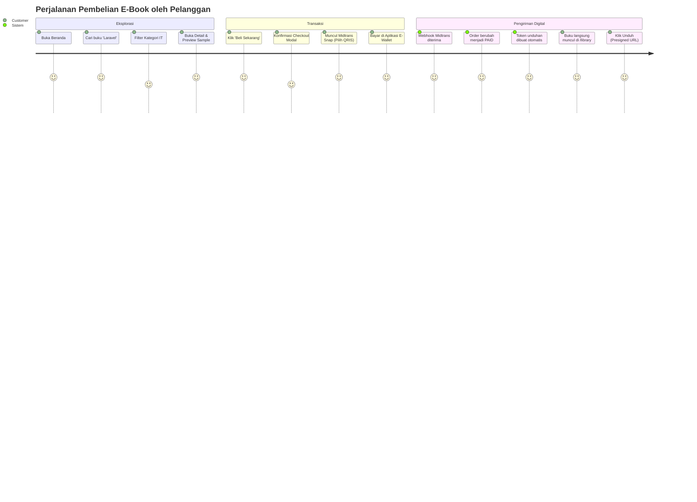

# 📋 Product Requirements Document (PRD) — Bookil

**Document Title:** Bookil Platform Requirements Specification  
**Version:** 1.0.0 (Production-Ready Baseline)  
**Status:** Approved / Active Baseline  
**Audience:** Project Reviewers, System Auditors, Software Engineers, UI/UX Designers, Product Managers  
**Date:** September 2026  

---

## 📑 Daftar Isi

1. [Ringkasan Eksekutif & Visi Produk](#1-ringkasan-eksekutif--visi-produk)
2. [Pernyataan Masalah & Solusi (Problem Statement)](#2-pernyataan-masalah--solusi-problem-statement)
3. [Tujuan Bisnis & Metrik Keberhasilan (KPIs)](#3-tujuan-bisnis--metrik-keberhasilan-kpis)
4. [Persona Pengguna (User Personas)](#4-persona-pengguna-user-personas)
5. [Peta Perjalanan Pengguna (User Journeys)](#5-peta-perjalanan-pengguna-user-journeys)
6. [Persyaratan Fungsional (Functional Requirements)](#6-persyaratan-fungsional-functional-requirements)
   * [FR-01: Storefront Catalog & Discovery](#fr-01-storefront-catalog--discovery)
   * [FR-02: Product Detail & Sample Preview](#fr-02-product-detail--sample-preview)
   * [FR-03: Otentikasi & Otorisasi Berbasis Peran](#fr-03-otentikasi--otorisasi-berbasis-peran)
   * [FR-04: Instant Checkout & Concurrency Locking](#fr-04-instant-checkout--concurrency-locking)
   * [FR-05: Integrasi Payment Gateway Midtrans Snap](#fr-05-integrasi-payment-gateway-midtrans-snap)
   * [FR-06: Webhook Reconciliation & Idempotent State Machine](#fr-06-webhook-reconciliation--idempotent-state-machine)
   * [FR-07: Secure Digital Delivery & Tokenization Engine](#fr-07-secure-digital-delivery--tokenization-engine)
   * [FR-08: Perpustakaan Digital & Faktur Pelanggan](#fr-08-perpustakaan-digital--faktur-pelanggan)
   * [FR-09: Executive Dashboard & Ekspor Laporan CSV](#fr-09-executive-dashboard--ekspor-laporan-csv)
   * [FR-10: Admin Catalog & Taxonomy Management](#fr-10-admin-catalog--taxonomy-management)
7. [Persyaratan Non-Fungsional (Non-Functional Requirements)](#7-persyaratan-non-fungsional-non-functional-requirements)
8. [Aturan Bisnis & Kebijakan Transaksi (Business Rules)](#8-aturan-bisnis--kebijakan-transaksi-business-rules)
9. [Batasan Ruang Lingkup & Peta Jalan Masa Depan (Roadmap)](#9-batasan-ruang-lingkup--peta-jalan-masa-depan-roadmap)

---

## 1. Ringkasan Eksekutif & Visi Produk

**Bookil** adalah platform perdagangan produk digital terkurasi (berfokus pada buku elektronik berkualitas tinggi di bidang teknologi, pemrograman, bisnis, desain, dan pengembangan diri) yang menghubungkan pembaca dengan aset pengetahuan terpercaya.

### Visi Produk
Menjadi ekosistem marketplace e-book digital terdepan di Indonesia yang memberikan pengalaman membaca instan, proses pembelian tanpa hambatan (*zero-friction checkout*), serta perlindungan hak cipta aset digital berkekuatan hukum dan teknis melalui arsitektur keamanan *Zero-Trust Storage*.

---

## 2. Pernyataan Masalah & Solusi (Problem Statement)

### Permasalahan yang Dihadapi (Pain Points)
1. **Kebocoran Aset Intelektual (Piracy Risk):** Sebagian besar platform e-commerce sederhana menyediakan tautan file statis yang diunggah ke folder publik web server (`public/uploads`), memungkinkan URL diakses dan disebarkan tanpa login atau verifikasi pembayaran.
2. **Manipulasi Harga Sisi Klien (Price Tampering):** Kerentanan umum terjadi saat aplikasi mempercayai nilai total harga yang dikirim dari browser pelanggan melalui form POST tanpa kalkulasi ulang di database internal.
3. **Pembelian Ganda & Inkonsistensi Transaksi (Race Conditions):** Ketika checkout terjadi beruntun dalam milidetik yang sama, transaksi dapat terduplikasi atau stok/status order menjadi kacau.
4. **Rekonsiliasi Pembayaran Lambat:** Verifikasi manual via bukti transfer bank memperlambat penerimaan file oleh pembeli dan membebani operasional pemilik bisnis.

### Solusi Bookil
1. **Isolasi Aset Private Disk + Presigned URLs:** Berkas e-book asli disimpan pada disk privat terenkripsi. Pengguna hanya memperoleh tautan sementara (*presigned URL*) berdurasi 15 menit setelah sistem memverifikasi integritas token unduh, kepemilikan faktur, dan kuota unduhan yang belum habis.
2. **Kalkulasi Desimal Presisi Backend:** Total nominal belanja dihitung ulang 100% pada layer Action backend menggunakan fungsi `bcadd` (menghindari error pembulatan tipe float).
3. **Pessimistic Concurrency Locking:** Baris produk dikunci dengan `lockForUpdate()` dalam transaksi basis data untuk menjamin validitas produk saat pemesanan.
4. **Otomatisasi Penuh Midtrans Snap:** Pelanggan membayar via Virtual Account / e-Wallet secara instan; webhook Midtrans yang diamankan dengan tanda tangan kriptografi `SHA-512` memicu pembuatan token digital otomatis dalam hitungan detik.

---

## 3. Tujuan Bisnis & Metrik Keberhasilan (KPIs)

| Kategori KPI | Indikator Kinerja Utama | Target Baseline (Q4 2026) |
| :--- | :--- | :--- |
| **Konversi Checkout** | Persentase klik beli hingga penyelesaian pembayaran | $\ge 68\%$ penyelesaian transaksi |
| **Kecepatan Pengiriman** | Waktu dari pembayaran terkonfirmasi hingga buku muncul di library | $< 2$ detik (Otomatis via Webhook) |
| **Integritas Aset** | Insiden kebocoran tautan publik tanpa otorisasi | **0 Insiden** (Tercapai melalui Private Disk) |
| **Akurasi Finansial** | Diskrepansi saldo antara gateway payment dan ledger sistem | **0.00%** (Sesuai verifikasi gross amount SHA-512) |
| **Performa Sistem** | Waktu muat halaman katalog (*Time to Interactive*) | $< 1.2$ detik pada koneksi 4G standar |

---

## 4. Persona Pengguna (User Personas)

### Persona 1: Rizqi — Pembaca & Software Engineer (End Customer)
* **Demografi:** Usia 26 tahun, berdomisili di Jakarta, Software Developer.
* **Tujuan:** Mencari panduan arsitektur software dan e-book teknis berbahasa Indonesia atau internasional yang berbobot untuk meningkatkan jenjang karir.
* **Kebutuhan Utama:**
  * Menemukan buku yang relevan dengan cepat melalui pencarian kata kunci dan filter kategori.
  * Membaca sample buku sebelum memutuskan membeli.
  * Pembayaran cepat menggunakan QRIS (GoPay/ShopeePay) atau BCA Virtual Account tanpa perlu konfirmasi manual via WhatsApp.
  * File e-book langsung tersedia di rak buku akunnya dan dapat diunduh ke iPad/laptop kapan pun dibutuhkan.
* **Poin Frustrasi:** Website yang lambat, harus menunggu admin memverifikasi bukti transfer, atau link unduhan mati.

### Persona 2: Maya — Content & E-Commerce Manager (Platform Admin)
* **Demografi:** Usia 29 tahun, Admin Operasional Platform Bookil.
* **Tujuan:** Mengelola katalog buku, memperbarui harga, mempublikasikan karya baru, dan meninjau pesanan bermasalah.
* **Kebutuhan Utama:**
  * Formulir manajemen produk yang rapi dengan validasi berkas (*PDF/EPUB/ZIP*) yang aman.
  * Kemampuan mengaktifkan/menonaktifkan publikasi produk dengan 1 klik.
  * Audit pesanan yang transparan untuk mencocokkan ID transaksi gateway dengan pesanan pelanggan.
* **Poin Frustrasi:** Dashboard yang rumit, tidak tersedianya log webhook ketika pelanggan bertanya mengapa pesanannya belum lunas.

### Persona 3: Arga — Business Owner & Lead Architect (Auditor / Executive)
* **Demografi:** Usia 35 tahun, Pemilik Bisnis & Lead Architect.
* **Tujuan:** Memantau metrik finansial, perputaran omzet, dan memastikan kepatuhan sistem terhadap standar keamanan data industri.
* **Kebutuhan Utama:**
  * Dashboard eksekutif yang menyajikan pendapatan kotor (*gross revenue*), jumlah order sukses, dan produk terlaris secara akurat.
  * Fitur streaming download laporan transaksi dalam format CSV untuk rekonsiliasi akuntansi bulanan.
  * Jaminan bahwa seluruh kode backend terbebas dari kerentanan SQL Injection, Mass-Assignment, dan Race-Condition.

---

## 5. Peta Perjalanan Pengguna (User Journeys)

### Journey 1: Pelanggan Menemukan & Membeli E-Book

---

## 6. Persyaratan Fungsional (Functional Requirements)

### FR-01: Storefront Catalog & Discovery
* **Prioritas:** Must-Have (MoSCoW: M)
* **User Story:** Sebagai pengunjung, saya ingin menjelajahi katalog e-book, mencari berdasarkan judul/penulis, dan menyaring berdasarkan kategori agar dapat menemukan buku yang saya minati.
* **Kriteria Penerimaan (Acceptance Criteria):**
  1. Menampilkan daftar e-book yang berstatus `is_published = true`. Produk draf tidak boleh tampil ke publik.
  2. Mendukung pencarian teks parsial (*case-insensitive*) pada kolom `title`, `author`, dan `description`.
  3. Mendukung filter berdasarkan `category_id` (atau slug kategori) yang aktif.
  4. Mendukung pengurutan (*sorting*) berdasarkan: Produk Terbaru (`latest`), Harga Terendah (`price_asc`), dan Harga Tertinggi (`price_desc`).
  5. Paginasi responsif dengan ukuran halaman 12 item per halaman.
* **Edge Cases:** Pencarian tanpa hasil harus menampilkan pesan kosong yang ramah (*Empty State*) disertai tombol reset filter.

### FR-02: Product Detail & Sample Preview
* **Prioritas:** Must-Have (MoSCoW: M)
* **User Story:** Sebagai calon pembeli, saya ingin melihat informasi detail buku, sampul berkualitas tinggi, sinopsis, tipe berkas, ukuran berkas, dan pratinjau cuplikan sebelum memutuskan untuk membeli.
* **Kriteria Penerimaan:**
  1. Halaman diakses melalui slug SEO-friendly (`/products/{product:slug}`).
  2. Jika produk berstatus tidak dipublikasikan (`is_published = false`), sistem me-return HTTP 404.
  3. Tersedia tombol "Lihat Sample Cuplikan" yang membuka modal pratinjau (*SamplePreviewModal*) yang interaktif.
  4. Menampilkan tombol aksi "Beli Sekarang" dengan harga berformat Rupiah standar (`Rp 189.000`).

### FR-03: Otentikasi & Otorisasi Berbasis Peran
* **Prioritas:** Must-Have (MoSCoW: M)
* **User Story:** Sebagai pengguna, saya ingin dapat mendaftar, masuk, dan keluar dari sistem dengan pemisahan peran yang tegas antara Customer dan Administrator.
* **Kriteria Penerimaan:**
  1. Pengguna baru otomatis mendapatkan peran `role = 'customer'` (enum `UserRole::CUSTOMER`).
  2. Kolom `role` dilindungi dari *Mass Assignment Protection* pada model `User`. Penetapan role `admin` hanya dapat dilakukan melalui seeder atau server console terpercaya.
  3. Middleware `EnsureUserIsAdmin` mengamankan seluruh rute grup `/admin/*`. Upaya akses oleh customer akan mengembalikan HTTP 403 Forbidden.
  4. Halaman perpustakaan (`/library`) dan checkout (`/checkout`) mewajibkan status terotentikasi (*auth middleware*). Tamu (*guest*) yang menekan tombol beli akan diarahkan ke halaman login terlebih dahulu.

### FR-04: Instant Checkout & Concurrency Locking
* **Prioritas:** Must-Have (MoSCoW: M)
* **User Story:** Sebagai pembeli terdaftar, saya ingin membeli buku pilihan saya secara langsung dengan kalkulasi harga yang aman dan tahan terhadap benturan transaksi konkuren.
* **Kriteria Penerimaan:**
  1. Permintaan checkout diproses oleh `CreateOrderAction` yang dibungkus dalam transaksi database (`DB::transaction`).
  2. Produk yang dibeli dikunci menggunakan pessimistic row locking (`lockForUpdate()`) untuk mencegah perubahan harga atau penarikan publikasi saat checkout berlangsung.
  3. Total harga dihitung ulang secara ketat di backend menggunakan fungsi `bcadd` presisi 2 desimal. Nilai harga yang dikirim oleh input klien diabaikan.
  4. Nomor pesanan unik dihasilkan dengan format standar `BK-[ULID]` (contoh: `BK-01J8K3R4...`).
  5. Mencegah pembelian produk yang tidak dipublikasikan dengan melempar `ProductUnavailableException`.
  6. Menerapkan *Rate Limiter* sebanyak 10 permintaan per menit (`throttle:10,1`) pada endpoint checkout.

### FR-05: Integrasi Payment Gateway Midtrans Snap
* **Prioritas:** Must-Have (MoSCoW: M)
* **User Story:** Sebagai pembeli, saya ingin menyelesaikan pembayaran menggunakan berbagai kanal perbankan Indonesia (BCA VA, Mandiri Bill, BNI, BRI, Permata, QRIS, GoPay) melalui jendela pembayaran resmi Midtrans Snap.
* **Kriteria Penerimaan:**
  1. `MidtransSnapService` menghasilkan Snap Token valid dengan menyertakan rincian `transaction_details` (order_id, gross_amount) dan `item_details` (id, price, name).
  2. Halaman invoice pesanan (`/orders/{order:order_number}`) secara otomatis memicu popup `window.snap.pay()` jika pesanan masih berstatus `pending`.
  3. Pembeli dapat menutup modal Snap dan membukanya kembali kapan saja selama pesanan belum kedaluwarsa.
  4. Tersedia callback JavaScript untuk menangani event `onSuccess`, `onPending`, `onError`, dan `onClose`.

### FR-06: Webhook Reconciliation & Idempotent State Machine
* **Prioritas:** Must-Have (MoSCoW: M)
* **User Story:** Sebagai sistem, saya ingin memproses notifikasi webhook dari Midtrans secara otomatis, memvalidasi integritas pesan, memperbarui status pesanan, dan mencatat audit payment ledger secara idempoten.
* **Kriteria Penerimaan:**
  1. Endpoint `/webhooks/midtrans` dikecualikan dari verifikasi token CSRF pada `bootstrap/app.php`.
  2. Verifikasi tanda tangan kriptografi wajib dilakukan dengan membandingkan:
     $$\text{Expected Signature} = \text{SHA-512}(\text{order\_id} + \text{status\_code} + \text{gross\_amount} + \text{server\_key})$$
     Jika tidak cocok, lempar `InvalidSignatureException` dan return HTTP 403/400.
  3. State Machine Order memetakan status Midtrans:
     * `settlement` atau `capture` (fraud status: `accept`) $\rightarrow$ `OrderStatus::PAID`
     * `pending` $\rightarrow$ `OrderStatus::PENDING`
     * `deny`, `cancel`, `failure` $\rightarrow$ `OrderStatus::FAILED`
     * `expire` $\rightarrow$ `OrderStatus::EXPIRED`
  4. **Idempotensi Penuh:** Pengiriman webhook duplikat untuk pesanan yang sudah `PAID` tidak akan memicu event berulang ataupun mengubah status kembali.
  5. Saat pesanan beralih ke `PAID`, sistem men-dispatch `OrderPaidEvent`.

### FR-07: Secure Digital Delivery & Tokenization Engine
* **Prioritas:** Must-Have (MoSCoW: M)
* **User Story:** Sebagai pembeli yang telah membayar, saya ingin mengunduh berkas e-book saya dengan tautan aman tanpa risiko tautan dicuri atau kuota dihabiskan oleh bot.
* **Kriteria Penerimaan:**
  1. Listener `GenerateDownloadTokensForPaidOrder` merespons `OrderPaidEvent` dan membuat token unduhan acak 64-karakter.
  2. Basis data **hanya menyimpan hash SHA-256** dari token (`download_tokens.token`). Plaintext token tidak pernah disimpan di database.
  3. Kuota unduhan ditetapkan default 5 kali (`max_downloads = 5`) dengan masa berlaku 30 hari (`expires_at = now() + 30 days`).
  4. Endpoint unduhan `/downloads/{token}` diproteksi rate limiter 30 request/menit (`throttle:30,1`).
  5. `GenerateSecureDownloadAction` memvalidasi:
     * Hak milik pembeli (`order.user_id === auth.id`).
     * Status pesanan wajib `PAID`.
     * Token belum kedaluwarsa (`expires_at > now()`).
     * Sisa kuota masih tersedia (`download_count < max_downloads`).
  6. Penambahan kuota unduh (`download_count`) dilakukan secara atomik di dalam `DB::transaction` dengan *row lock*.
  7. Menghasilkan *time-limited presigned URL* berdurasi 15 menit ke penyimpanan privat (S3/Cloudflare R2/Local Storage), lalu mengalihkan browser pengguna via HTTP 302 redirect.

### FR-08: Perpustakaan Digital & Faktur Pelanggan
* **Prioritas:** Must-Have (MoSCoW: M)
* **User Story:** Sebagai pelanggan, saya ingin mengakses rak buku digital saya di `/dashboard` dan `/library` untuk melihat koleksi e-book saya beserta riwayat transaksi masa lalu.
* **Kriteria Penerimaan:**
  1. Menampilkan seluruh item pesanan yang berstatus `PAID` dalam tata letak kartu buku (*Library Cards*).
  2. Menampilkan informasi visual kuota: sisa unduhan dan tanggal kedaluwarsa token.
  3. Menampilkan daftar riwayat pesanan (semua status: pending, paid, failed, expired) yang dipaginasi.
  4. Halaman invoice `/orders/{order:order_number}` dapat diakses sewaktu-waktu oleh pembeli yang sah untuk mencetak faktur atau melanjutkan pembayaran.

### FR-09: Executive Dashboard & Ekspor Laporan CSV
* **Prioritas:** Should-Have (MoSCoW: S)
* **User Story:** Sebagai Admin / Pemilik Bisnis, saya ingin melihat ringkasan omzet, volume pesanan, dan mengunduh data penjualan dalam format CSV untuk rekonsiliasi keuangan.
* **Kriteria Penerimaan:**
  1. Halaman `/admin/dashboard` menampilkan 5 metrik utama: Pendapatan Kotor Lunas (*Gross Revenue*), Total Pesanan Masuk, Pesanan Berhasil, Total Produk Aktif, dan Total Pelanggan Terdaftar.
  2. Menyajikan daftar 10 transaksi terakhir secara real-time dan daftar 5 buku terlaris (*Top Products*).
  3. Fitur ekspor CSV di `/admin/reports/sales/csv` menggunakan teknologi *StreamedResponse* chunking 200 baris, hemat memori RAM server, dan menyematkan header UTF-8 BOM (`\xEF\xBB\xBF`) agar langsung kompatibel dengan Microsoft Excel tanpa karakter rusak.

### FR-10: Admin Catalog & Taxonomy Management
* **Prioritas:** Must-Have (MoSCoW: M)
* **User Story:** Sebagai Admin, saya ingin mengelola produk buku digital dan kategori buku secara menyeluruh.
* **Kriteria Penerimaan:**
  1. CRUD Lengkap untuk Produk: Tambah buku, edit metadata, upload cover image (disimpan ke public disk), upload file e-book privat (disimpan ke private disk), dan hapus buku.
  2. Fitur Toggle Publish instan: Mengubah status `is_published` antara draf dan publik dengan 1 klik.
  3. **Relational Integrity Shield:** Produk yang sudah pernah dibeli oleh pelanggan dalam suatu pesanan **dilarang dihapus** dari database (`order_items.product_id` memiliki aturan `restrictOnDelete`). Sistem harus mengembalikan notifikasi kesalahan yang ramah alih-alih crash error 500.
  4. CRUD Kategori Buku: Tambah dan edit kategori dengan aturan `restrictOnDelete` jika kategori masih memiliki produk aktif.

---

## 7. Persyaratan Non-Fungsional (Non-Functional Requirements)

### NFR-01: Keamanan (Security)
* **Zero Trust File Exposure:** Direktori penyimpanan berkas e-book (`storage/app/private/ebooks` atau AWS S3 Bucket) tidak boleh dapat diakses melalui web server secara langsung. Akses file publik harus menghasilkan HTTP 403 Forbidden.
* **Otentikasi & Enkripsi:** Password pengguna wajib dienkripsi menggunakan algoritma `Bcrypt` dengan cost factor 12. Token unduhan di-hash dengan `SHA-256`. Payload webhook diverifikasi dengan `SHA-512`.
* **Proteksi Injeksi & XSS:** Seluruh kueri basis data memanfaatkan PDO Prepared Statements via Eloquent ORM. Seluruh output tampilan disanitasi otomatis oleh React JSX.
* **CSRF Exemption Whitelisting:** CSRF verifier hanya mengecualikan rute spesifik `webhooks/*`. Seluruh rute customer dan admin mewajibkan token CSRF valid.

### NFR-02: Integritas Data & Konkurensi (Data Integrity & Concurrency)
* **Floating-Point Immunity:** Dilarang keras melakukan operasi aritmatika harga menggunakan tipe data `float` pada PHP. Seluruh perhitungan wajib memanfaatkan pustaka `BCMath` (`bcadd`, `bcmul`) dengan presisi desimal 2.
* **Anti-Race-Condition:** Operasi checkout dan pertambahan kuota unduhan wajib menerapkan *Pessimistic Locking* (`lockForUpdate`) dalam transaksi database ACID.
* **Strict Eloquent Mode:** Diaktifkan via `Model::shouldBeStrict()` pada `AppServiceProvider` untuk mencegah *lazy loading violation*, *silently discarded mass assignments*, dan *accessing missing attributes* selama pengembangan.

### NFR-03: Performa & Skalabilitas (Performance)
* **Response Time Target:** Waktu respons API katalog $< 250\text{ ms}$ pada 95th percentile (P95).
* **Database Indexing:** Composite index wajib dipasang pada kombinasi kueri umum: `(is_published, category_id, price)`, `(user_id, created_at)`, dan `(status, created_at)`.
* **Asset Preloading & Bundling:** Vite build menghasilkan asset JavaScript yang dipecah (*code-splitting*) per halaman Inertia untuk meminimalkan beban transfer awal.

### NFR-04: Ketersediaan & Keandalan (Reliability)
* Sistem harus mampu menangani pengiriman webhook Midtrans yang tertunda (*delayed webhooks*) atau dikirim berulang kali tanpa memicu inkonsistensi saldo.
* Penanganan kesalahan menggunakan *Custom Domain Exceptions* yang tercatat rapi pada log Laravel tanpa membocorkan stack trace sensitif ke pengguna akhir.

### NFR-05: Aksesibilitas & Kompatibilitas (Usability & Accessibility)
* Mengikuti pedoman **WCAG 2.1 Level AA** dengan rasio kontras warna teks terhadap latar belakang minimal 4.5:1.
* Tata letak responsif penuh (*Mobile-First Responsive Design*) yang nyaman diakses pada perangkat smartphone, tablet, laptop, dan monitor desktop lebar.

---

## 8. Aturan Bisnis & Kebijakan Transaksi (Business Rules)

1. **Aturan Satu Item per Transaksi (Instant Purchase):** Untuk memaksimalkan laju konversi, alur checkout saat ini menerapkan model *Buy Now* langsung per item produk tanpa keranjang multi-item.
2. **Masa Berlaku Pesanan Pending:** Pesanan berstatus `pending` memiliki batas kedaluwarsa maksimal 24 jam dari waktu pembuatan. Notifikasi expire dari Midtrans akan membatalkan pesanan secara otomatis.
3. **Kebijakan Kuota Unduhan:** Setiap pembelian satu lisensi e-book memberikan hak unduh sebanyak 5 kali dalam periode 30 hari kalender. Jika kuota habis karena kendala teknis perangkat, pelanggan dapat menghubungi admin untuk pembaruan kuota manual.
4. **Kebijakan Pembatalan & Pengembalian Dana (Refund):** Produk digital yang telah diterbitkan token unduhannya tidak dapat dikembalikan, kecuali terdapat cacat format berkas yang diverifikasi oleh administrator.

---

## 9. Batasan Ruang Lingkup & Peta Jalan Masa Depan (Roadmap)

### Scope Saat Ini (Phase 1 Baseline — COMPLETED)
* Arsitektur monolitik Laravel 13 + Inertia React 19.
* Katalog produk publik dengan filter dan modal preview.
* Instant Checkout dengan Midtrans Snap dan webhook SHA-512.
* Mesin unduh tokenized presigned URL ber-kuota.
* Dashboard digital library pelanggan.
* Admin portal (Executive analytics, CSV export, CRUD produk/kategori, audit order).
* Suite pengujian Pest PHP (139 pengujian, 100% lulus).

### Rencana Pengembangan Masa Depan (Future Roadmap)
* **Phase 2 (Q1 2027): Multi-Item Shopping Cart & Diskon Promosi**
  * Fitur keranjang belanja multi-produk (*Shopping Cart*).
  * Sistem kode kupon promo (*Voucher & Discount Engine*).
  * Notifikasi email otomatis menggunakan template Markdown (Invoice & Bukti Pembayaran).
* **Phase 3 (Q2 2027): In-App E-Reader & Mobile Application**
  * Fitur membaca e-book langsung di browser tanpa perlu mengunduh file fisik (*Web E-Reader with DRM Watermark*).
  * Integrasi API untuk mobile app (React Native / Flutter).
  * Program afiliasi penulis (*Author Affiliate & Royalty System*).
