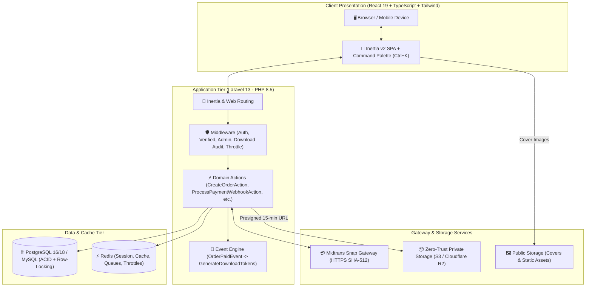

<div align="center">

# 📚 Bookil — Enterprise Digital Bookstore Platform

**Modern, Secure & Scalable Full-Stack E-Book Marketplace with Zero-Trust Digital Delivery**

[](https://github.com/MasRizqi07/harisenin-bookil-fsd/actions/workflows/tests.yml?query=branch%3Asession-1)
[](https://php.net)
[](https://laravel.com)
[](https://inertiajs.com)
[](https://react.dev)
[](https://www.typescriptlang.org)
[](https://tailwindcss.com)
[](tests)
[](https://github.com/laravel/pint)
[](LICENSE)

<br />

[📖 PRD](PRD.md) •
[🏛 Architecture](Architecture.md) •
[🎨 Design System](Design_system.md) •
[🧪 QA Testing Guide](docs/QA_TESTING_GUIDE.md) •
[💼 Client Presentation](docs/CLIENT_PRESENTATION.md) •
[🔌 API Reference](docs/API_INTEGRATION.md) •
[🛡 Security Whitepaper](docs/SECURITY_AUDIT.md) •
[🚀 Deployment](docs/DEPLOYMENT.md)

</div>

---

## 🌟 Executive Summary & Value Proposition

**Bookil** adalah platform perdagangan produk digital terkurasi (e-book teknologi, pemrograman, bisnis, dan desain) berstandar industri perbankan yang menghubungkan penerbit dan pembaca dengan pengalaman *zero-friction instant checkout*, pengiriman digital instan otomatis, serta perlindungan hak cipta berkas melalui arsitektur keamanan **Zero-Trust Private Storage**.

### 💡 Problem vs. Solution

| Masalah Umum E-Commerce Buku Tradisional | Solusi Rekayasa di Bookil |
| :--- | :--- |
| **Kebocoran Aset Publik:** File e-book disimpan di `public/uploads`, mudah disebar via tautan statis. | **Zero-Trust Private Storage:** Berkas disimpan di disk privat terenkripsi (S3/Cloudflare R2). Pengunduhan mewajibkan verifikasi token dan dialihkan ke **15-Minute Presigned Temporary URLs**. |
| **Manipulasi Harga Sisi Klien (Price Tampering):** Data harga dari form browser dipercayai server. | **Server-Side Recalculation:** Harga dihitung ulang 100% di backend menggunakan pustaka desimal presisi **BCMath (`bcadd`)**. Form input klien diabaikan. |
| **Transaksional Bentrok (Race Conditions):** Klik ganda atau webhook paralel memicu pesanan ganda / kuota bocor. | **Pessimistic Concurrency Locking:** Operasi checkout dan pencatatan kuota dilindungi kueri database **`lockForUpdate()`** dalam transaksi ACID. |
| **Verifikasi Pembayaran Manual:** Konfirmasi mutasi bank manual via WhatsApp memperlambat kepuasan pembeli. | **Automasi Midtrans Snap & Webhook Kriptografis:** Pembayaran instan via QRIS/VA dengan verifikasi webhook otomatis berstandar **HMAC SHA-512** dan status idempoten. |

---

## 🏗 High-Level Architecture

Bookil dibangun dengan pendekatan **Modern Monolithic (Inertia.js v2 Single-Page Application)** yang memadukan keandalan dan keamanan backend Laravel 13 dengan reaktivitas interaktif React 19 dan TypeScript.



---

## 🎯 Core Features & Capabilities

### 🛍️ 1. Storefront & Public Discovery
* **Bento Grid Hero Showcase:** Menampilkan koleksi e-book pilihan, rating kepuasan pembaca, dan statistik platform.
* **Instant Filter & Search:** Pencarian teks *case-insensitive* (`title`, `author`, `description`) dengan filter kategori instan.
* **Quick Navigation via Command Palette:** Akses pencarian global cepat menggunakan pintasan keyboard `Ctrl + K`.
* **Interactive Sample Preview Modal:** Membaca daftar isi (*Table of Contents*) dan cuplikan bab sebelum memutuskan membeli.
* **Responsive Mobile-First UI:** Tampilan teroptimasi sempurna dari smartphone 320px, tablet 768px, hingga layar 4K.

### 💳 2. Instant Checkout & Midtrans Snap Gateway
* **One-Click Buy Now:** Alur pemesanan langsung tanpa keranjang berbelit-belit untuk laju konversi maksimal.
* **Anti-Tampering Backend Pricing:** Penjumlahan total pesanan dihitung ulang via `bcadd` (bebas dari error floating-point IEEE-754).
* **Midtrans Snap Popup:** Pembayaran instan mendukung QRIS (GoPay, ShopeePay, OVO), BCA VA, Mandiri Bill, BNI, BRI, Permata, dan Kartu Kredit.
* **Idempotent Webhook Handler:** Verifikasi tanda tangan kriptografi `SHA-512` dengan komparasi waktu konstan `hash_equals()`. Webhook berulang diproses aman tanpa duplikasi event atau saldo.
* **Automated Reconciliation:** Command `php artisan bookil:reconcile {order_number}` untuk rekonsiliasi status tagihan langsung dari server Midtrans.

### 🛡️ 3. Zero-Trust Digital Delivery & Tokenization Engine
* **Digest-Only Storage:** Database **hanya menyimpan hash SHA-256** dari token unduhan. Plaintext bearer token tidak pernah disimpan di disk atau database.
* **Presigned Download URLs:** Berkas e-book asli dialihkan ke URL bertanda tangan kriptografi berdurasi 15 menit.
* **Quota & Expiry Management:** Hak unduh default 5 kali per item dengan masa aktif 30 hari.
* **Rate Limiting & Audit Trail:** Pembatasan 30 request/menit (`throttle:downloads`) dengan pencatatan otomatis di tabel `download_attempts`.
* **Admin Entitlement Extension:** Admin dapat memperpanjang kuota (+jumlah unduh) dan masa berlaku (+hari) pesanan sah dengan audit trail lengkap.

### 📊 4. Admin Executive Dashboard & Management Portal
* **Executive Metrics & Analytics:** Gross revenue lunas, total pesanan masuk, paid conversion rate, katalog aktif, dan total pembeli terdaftar.
* **Streaming Sales Report CSV:** Ekspor laporan penjualan berkecepatan tinggi menggunakan *StreamedResponse* dengan header UTF-8 BOM (`\xEF\xBB\xBF`) agar langsung terbaca rapi di Microsoft Excel.
* **Product & Category CRUD:** Pengelolaan buku dengan upload terpisah (Cover ke disk publik, File e-book ke disk privat) dan tombol *toggle publish* instan.
* **Relational Integrity Protection:** Proteksi `restrictOnDelete` mencegah penghapusan buku atau kategori yang sudah memiliki transaksi faktur.
* **Forensic Order Audit:** Inspeksi transaksi mendalam dengan viewer JSON mentah payload webhook Midtrans.

---

## 💻 Tech Stack & Engineering Standards

| Lapisan Sistem | Teknologi Terpilih | Catatan & Rationale Rekayasa |
| :--- | :--- | :--- |
| **Backend Framework** | [Laravel 13](https://laravel.com) | Framework enterprise PHP dengan fitur Action-Domain, Event-driven architecture, dan Strict Eloquent Mode. |
| **Runtime Language** | [PHP 8.5+](https://php.net) | Bahasa dengan performa OPcache JIT tinggi dan tipe data ketat (`declare(strict_types=1)`). |
| **Frontend Framework** | [React 19](https://react.dev) + [TypeScript](https://typescriptlang.org) | Reaktivitas UI modern dengan validasi tipe statis menyeluruh. |
| **Fullstack Glue** | [Inertia.js v2](https://inertiajs.com) | Menghubungkan Laravel & React tanpa kerumitan client-side routing atau GraphQL/REST overhead. |
| **Styling & UI Tokens** | [Tailwind CSS 3.x](https://tailwindcss.com) + Headless UI | Utility-first CSS dengan desain sistem terstandarisasi, responsif, dan WCAG 2.1 AA compliant. |
| **Database Tier** | [PostgreSQL 16/18](https://postgresql.org) / [MySQL 8+](https://mysql.com) | Relational database dengan integritas ACID, Foreign Key constraints, dan Pessimistic Row Locking (`FOR UPDATE`). |
| **In-Memory & Cache** | [Redis](https://redis.io) via `predis/predis` | Manajemen session, atomic rate limiters, queue workers, dan audit deduplication. |
| **Payment Gateway** | [Midtrans Snap API](https://midtrans.com) | Gateway pembayaran resmi Indonesia dengan verifikasi tanda tangan SHA-512 dan rekonsiliasi idempoten. |
| **Secure Storage** | Private S3 / Cloudflare R2 | Penyimpanan berkas privat terenkripsi dengan pengiriman melalui 15-minute Presigned URLs. |
| **Testing Suite** | [Pest PHP 4.x](https://pestphp.com) | **197 Automated Tests (1,184 Assertions)** dengan 100% kelulusan pada database PostgreSQL nyata. |
| **Code Formatter** | [Laravel Pint](https://github.com/laravel/pint) | Standar format kode PHP PSR-12 ketat. |

---

## ⚡ Quickstart & Local Setup Guide

Ikuti panduan berikut untuk menjalankan Bookil di lingkungan lokal pengembangan Anda:

### 1. Prasyarat Sistem
* PHP $\ge 8.5$ dengan ekstensi: `pdo`, `pdo_pgsql` atau `pdo_mysql`, `bcmath`, `curl`, `mbstring`, `fileinfo`, `openssl`.
* Node.js $\ge 20.x$ dan npm $\ge 10.x$.
* Composer $\ge 2.7$.
* Database PostgreSQL $\ge 16$ atau MySQL $\ge 8.0$ (SQLite didukung untuk pengetesan instan).

### 2. Langkah Instalasi

```bash
# 1. Clone repositori
git clone https://github.com/MasRizqi07/harisenin-bookil-fsd.git
cd harisenin-bookil-fsd

# 2. Install dependensi backend & frontend
composer install
npm install

# 3. Salin konfigurasi environment
cp .env.example .env

# 4. Generate application encryption key
php artisan key:generate

# 5. Konfigurasi Database pada file .env
# Contoh untuk PostgreSQL:
# DB_CONNECTION=pgsql
# DB_HOST=127.0.0.1
# DB_PORT=5432
# DB_DATABASE=bookil
# DB_USERNAME=postgres
# DB_PASSWORD=your_password

# 6. Jalankan migrasi dan seeder awal
php artisan migrate --seed

# 7. Hubungkan storage publik untuk cover buku
php artisan storage:link

# 8. Build aset frontend
npm run build
```

### 3. Menjalankan Server Pengembangan

Anda dapat menjalankan seluruh dependensi server secara serentak menggunakan perintah `composer dev`:

```bash
composer dev
```
Perintah ini akan menjalankan secara paralel:
* **Server HTTP Laravel:** `http://127.0.0.1:8000`
* **Vite Hot Module Replacement (HMR)** untuk reload React instan
* **Queue Worker:** Pemroses antrean email tanda terima pesanan
* **Pail Realtime Logs:** Pemantau log server langsung di terminal

---

## 🧪 Quality Assurance & Test Verification

Bookil menerapkan metodologi pengujian komprehensif yang menguji seluruh lapisan sistem secara ketat.

### Ringkasan Bukti Pengujian (Test Evidence)

```text
   PASS  Tests\Unit\ExampleTest
   PASS  Tests\Feature\Actions\CreateOrderActionTest
   PASS  Tests\Feature\Actions\ProcessPaymentWebhookActionTest
   PASS  Tests\Feature\Actions\GenerateSecureDownloadActionTest
   PASS  Tests\Feature\BookilConstraintsTest
   PASS  Tests\Feature\BookilModelsTest
   PASS  Tests\Feature\BookilPreflightTest
   PASS  Tests\Feature\BookilReconcileTest
   PASS  Tests\Feature\BrowserRegressionTest
   PASS  Tests\Feature\CatalogTest
   PASS  Tests\Feature\CheckoutRateLimitTest
   PASS  Tests\Feature\CheckoutTest
   PASS  Tests\Feature\CustomerIntegrityTest
   PASS  Tests\Feature\CustomerLibraryTest
   PASS  Tests\Feature\DeploymentWiringTest
   PASS  Tests\Feature\DownloadAuditRetentionTest
   PASS  Tests\Feature\DownloadRouteTest
   PASS  Tests\Feature\EntitlementExtensionTest
   PASS  Tests\Feature\OrderReceiptTest
   PASS  Tests\Feature\PaymentWebhookRouteTest
   PASS  Tests\Feature\ProfileTest
   PASS  Tests\Feature\RoutingGuardsTest
   PASS  Tests\Feature\Admin\AdminCategoryTest
   PASS  Tests\Feature\Admin\AdminDashboardTest
   PASS  Tests\Feature\Admin\AdminOrderTest
   PASS  Tests\Feature\Admin\AdminProductTest
   PASS  Tests\Feature\Auth\AuthenticationTest
   PASS  Tests\Feature\Auth\EmailVerificationTest
   PASS  Tests\Feature\Auth\PasswordConfirmationTest
   PASS  Tests\Feature\Auth\PasswordResetTest
   PASS  Tests\Feature\Auth\PasswordUpdateTest
   PASS  Tests\Feature\Auth\RegistrationTest
   PASS  Tests\Migrations\BookilMigrationTest
   PASS  Tests\Migrations\PostgresRowLockTest
   PASS  Tests\Migrations\ReceiptCommitBoundaryTest

   Tests:    204 passed (1260 assertions)
   Duration: ~11.3s
```

### Menjalankan Pengujian Mandiri

```bash
# Menjalankan seluruh test suite
php artisan test

# Menjalankan pengujian konkurensi row-lock PostgreSQL
php artisan test --filter=PostgresRowLockTest

# Memeriksa standardisasi format kode PHP
php vendor/bin/pint --test

# Memeriksa typechecking TypeScript
npm run typecheck
```

> [!NOTE]
> Pengujian konkurensi row-lock (`PostgresRowLockTest`) memvalidasi respon PostgreSQL `SQLSTATE 55P03` saat dua koneksi konkuren mencoba mengunci baris produk yang sama dalam selang waktu 500ms.

---

## 📂 Struktur Repositori & Navigasi Kode

```text
harisenin-bookil-fsd/
├── app/
│   ├── Actions/                  # Domain Business Actions (Single Responsibility)
│   │   ├── Downloads/            # GenerateSecureDownloadAction
│   │   ├── Orders/               # CreateOrderAction
│   │   └── Payments/             # ProcessPaymentWebhookAction
│   ├── Console/Commands/         # Artisan Commands (bookil:preflight, bookil:reconcile)
│   ├── Enums/                    # String-backed enums (OrderStatus, PaymentStatus, UserRole, FileType)
│   ├── Events/ & Listeners/      # Event-driven workflows (OrderPaidEvent -> GenerateDownloadTokens)
│   ├── Exceptions/               # Custom Domain Exceptions (DownloadQuotaExceeded, InvalidSignature, etc.)
│   ├── Http/
│   │   ├── Controllers/          # Thin Controllers (Admin, Customer, Checkout, Webhooks)
│   │   ├── Middleware/           # Security, Signed URL, Role verification, Download Audit
│   │   └── Requests/             # Form Requests & Input Validations
│   ├── Models/                   # Eloquent Entities (User, Product, Order, OrderItem, Payment, etc.)
│   ├── Policies/                 # Authorization Policies (ProductPolicy, OrderPolicy)
│   └── Services/                 # Gateway Integrations (MidtransSnapService)
├── resources/
│   ├── js/
│   │   ├── Components/           # Reusable UI Atoms & Molecules (BentoHero, ProductCard, Modals)
│   │   ├── Layouts/              # Page Shells (StoreLayout, AuthenticatedLayout, AdminLayout)
│   │   └── Pages/                # Inertia Page Views (Storefront, Detail, Invoices, Admin, Auth)
├── routes/
│   ├── web.php                   # Web Routes (Storefront, Checkout, Downloads, Admin, Webhook)
│   └── auth.php                  # Authentication Routes
├── tests/
│   ├── Feature/                  # Feature & Integration Tests (197 Tests)
│   ├── Migrations/               # Database constraints & PostgreSQL row-lock concurrency tests
│   └── TestCase.php              # Base Test Configuration
└── docs/                         # Dokumen Lengkap Teknis, QA & Operasional
```

---

## 📚 Pusat Dokumentasi Teknis (Documentation Hub)

Dokumentasi Bookil disusun secara mendalam dan terstruktur untuk memenuhi kebutuhan tiga pemangku kepentingan utama: **Reviewer / Asesor**, **Client / Pemilik Bisnis**, dan **QA Engineer**:

| Dokumen | Target Audiens | Ringkasan Konten |
| :--- | :--- | :--- |
| **[PRD.md](PRD.md)** | Product Manager, Auditor, Client | Spesifikasi kebutuhan produk lengkap, visi bisnis, metrik KPI, persona pengguna, functional & non-functional requirements. |
| **[Architecture.md](Architecture.md)** | Software Architect, Tech Lead, Reviewer | Arsitektur C4 Model, Entity-Relationship Diagram (ERD), diagram sekuens transaksi, strategi konkurensi row-lock, dan katalog domain exception. |
| **[Design_system.md](Design_system.md)** | UI/UX Designer, Frontend Engineer | Spesifikasi desain sistem lengkap: token warna, skala tipografi Figtree, radius, inventaris komponen UI, dan standar aksesibilitas WCAG 2.1 AA. |
| **[Design.md](Design.md)** | UI/UX Designer, Frontend Developer | Arsitektur informasi, sitemap aplikasi, UX page-by-page specs, state handling, dan strategi responsif mobile-first. |
| **[QA_TESTING_GUIDE.md](docs/QA_TESTING_GUIDE.md)** | QA Engineer, Software Tester, Reviewer | Panduan pengujian mutu menyeluruh: skenario pengujian fungsional/non-fungsional, matriks edge cases, panduan simulasi webhook, dan checklist regresi. |
| **[CLIENT_PRESENTATION.md](docs/CLIENT_PRESENTATION.md)** | Klien, Investor, Business Stakeholders | Panduan presentasi proyek, slide deck, naskah demo interaktif (*live walkthrough script*), proposisi ROI, dan penanganan pertanyaan umum (Q&A). |
| **[API_INTEGRATION.md](docs/API_INTEGRATION.md)** | Backend Engineer, Integrator | Referensi endpoint API lengkap, format payload Midtrans Snap, skema verifikasi webhook HMAC SHA-512, dan spesifikasi download engine bertanda tangan. |
| **[SECURITY_AUDIT.md](docs/SECURITY_AUDIT.md)** | Security Auditor, DevSecOps | Whitepaper keamanan sistem: mitigasi OWASP Top 10, isolasi Zero-Trust Private Storage, digest-only tokenization, dan rate-limiting policies. |
| **[DEPLOYMENT.md](docs/DEPLOYMENT.md)** | DevOps, SRE, System Administrator | Topologi hosting Ubuntu VPS, konfigurasi Nginx/Caddy, Cloudflare SSL/WAF, Redis workers, audit cron, dan CSP Report-Only inventory. |
| **[RUNBOOK.md](docs/RUNBOOK.md)** | Site Reliability Engineer, Support Lead | Prosedur operasional penanganan insiden: rekonsiliasi manual order macet, perpanjangan hak unduh, rotasi key Midtrans, dan drill backup/restore database. |
| **[READINESS.md](docs/READINESS.md)** | Release Manager, Reviewer | Matriks kesiapan rilis (Tier 1 Code Evidence vs Tier 2 Staging Verification vs Tier 3 Live Operations). |

---

## 🛡️ Hak Cipta & Lisensi

Proyek **Bookil** dilisensikan di bawah lisensi open-source [MIT License](LICENSE).  
Hak Cipta © 2026 **Bookil Platform**. Seluruh hak dilindungi undang-undang.
