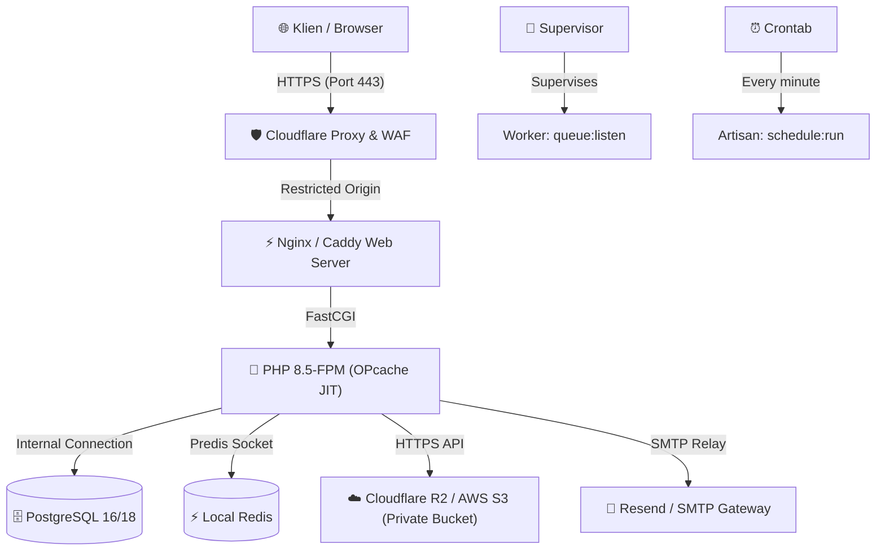

# 🚀 Production Deployment & Staging Verification Guide — Bookil

**Document Title:** Bookil Platform Deployment Operations, Server Provisioning & Verification Guide  
**Version:** 1.1.0 (Production Operations Baseline)  
**Status:** Approved / Active Baseline  
**Audience:** DevOps Engineers, Site Reliability Engineers (SRE), System Administrators, Technical Auditors  
**Date:** September 2026  

---

## 📑 Daftar Isi

1. [Topologi Server & Arsitektur Hosting](#1-topologi-server--arsitektur-hosting)
2. [Prasyarat Perangkat Keras & Perangkat Lunak](#2-prasyarat-perangkat-keras--perangkat-lunak)
3. [Konfigurasi Environment Production (`.env.production`)](#3-konfigurasi-environment-production-envproduction)
4. [Langkah-Langkah Rilis Terkontrol (Controlled Release Pipeline)](#4-langkah-langkah-rilis-terkontrol-controlled-release-pipeline)
5. [Konfigurasi Web Server (Nginx / Caddy & Cloudflare WAF)](#5-konfigurasi-web-server-nginx--caddy--cloudflare-waf)
6. [Konfigurasi Process Supervisor & Queue Workers](#6-konfigurasi-process-supervisor--queue-workers)
7. [Penjadwalan Cron Job & Automated Audit Pruning](#7-penjadwalan-cron-job--automated-audit-pruning)
8. [Prosedur Verifikasi Staging & Preflight Check](#8-prosedur-verifikasi-staging--preflight-check)
9. [Prosedur Rollback Cepat (Zero-Downtime Rollback)](#9-prosedur-rollback-cepat-zero-downtime-rollback)

---

## 1. Topologi Server & Arsitektur Hosting

Bookil dirancang untuk dapat di-hosting secara efisien pada **1 unit Ubuntu LTS VPS** tanpa memerlukan kluster Kubernetes yang rumit:



---

## 2. Prasyarat Perangkat Keras & Perangkat Lunak

### Spesifikasi Server Minimum (Untuk 10.000 Pengunjung Harian):
* **OS:** Ubuntu 24.04 LTS (x86_64 / ARM64)
* **CPU:** 2 vCPU / Core
* **RAM:** 4 GB RAM (Minimal 2 GB dengan swap 2 GB)
* **Storage:** 40 GB NVMe SSD
* **PHP Runtime:** PHP 8.5+ dengan modul: `php8.5-fpm`, `php8.5-pgsql`, `php8.5-bcmath`, `php8.5-curl`, `php8.5-mbstring`, `php8.5-xml`, `php8.5-zip`, `php8.5-intl`.
* **Database:** PostgreSQL 16+ (atau MySQL 8.0+)
* **Cache & Queue:** Redis 7.x
* **Node.js:** v20.x LTS & npm (hanya dibutuhkan pada build server / CI runner).

---

## 3. Konfigurasi Environment Production (`.env.production`)

Berikut adalah template konfigurasi penting untuk lingkungan produksi:

```dotenv
# Identitas Aplikasi
APP_NAME=Bookil
APP_ENV=production
APP_KEY=base64:YOUR_SECRET_APPLICATION_KEY_HERE
APP_DEBUG=false
APP_URL=https://bookil.com

# Konfigurasi Proxy Cloudflare
APP_BEHIND_PROXY=true
TRUSTED_PROXIES="173.245.48.0/20,103.21.244.0/22,103.22.200.0/22,103.31.4.0/22,141.101.64.0/18,108.162.192.0/18,190.93.240.0/20,188.114.96.0/20,197.234.240.0/22,198.41.128.0/17,162.158.0.0/15,104.16.0.0/13,104.24.0.0/14,172.64.0.0/13,131.0.72.0/22"

# Database PostgreSQL
DB_CONNECTION=pgsql
DB_HOST=127.0.0.1
DB_PORT=5432
DB_DATABASE=bookil_production
DB_USERNAME=bookil_user
DB_PASSWORD=VERY_STRONG_DB_PASSWORD

# Redis & Sessions
REDIS_CLIENT=predis
REDIS_HOST=127.0.0.1
REDIS_PORT=6379
CACHE_STORE=redis
SESSION_DRIVER=redis
SESSION_SECURE_COOKIE=true
SESSION_ENCRYPT=true
QUEUE_CONNECTION=redis

# Private Storage (Cloudflare R2 / AWS S3)
PRIVATE_DISK=s3
AWS_ACCESS_KEY_ID=YOUR_R2_ACCESS_KEY
AWS_SECRET_ACCESS_KEY=YOUR_R2_SECRET_KEY
AWS_DEFAULT_REGION=auto
AWS_BUCKET=bookil-private-assets
AWS_ENDPOINT=https://YOUR_ACCOUNT_ID.r2.cloudflarestorage.com
AWS_USE_PATH_STYLE_ENDPOINT=true

# Midtrans Production Gateway
MIDTRANS_SERVER_KEY=Mid-server-YOUR_PRODUCTION_SERVER_KEY
MIDTRANS_CLIENT_KEY=Mid-client-YOUR_PRODUCTION_CLIENT_KEY
MIDTRANS_IS_PRODUCTION=true
BOOKIL_PAYMENT_SIMULATOR_ENABLED=false

# SMTP Mail Relay (Resend)
MAIL_MAILER=smtp
MAIL_HOST=smtp.resend.com
MAIL_PORT=465
MAIL_USERNAME=resend
MAIL_PASSWORD=re_YOUR_RESEND_API_KEY
MAIL_ENCRYPTION=tls
MAIL_FROM_ADDRESS=support@bookil.com
MAIL_FROM_NAME="Bookil Support"
```

---

## 4. Langkah-Langkah Rilis Terkontrol (Controlled Release Pipeline)

Jalankan perintah berikut di server produksi menggunakan user non-root (`deploy` atau `bookil`):

```bash
# 1. Aktifkan Maintenance Mode dengan secret bypass
php artisan down --secret="bookil-ops-bypass-key"

# 2. Tarik kode versi rilis terbaru
git fetch origin
git checkout tags/v1.1.0  # atau git pull origin production

# 3. Install dependensi PHP produksi (tanpa dev packages)
composer install --no-dev --prefer-dist --optimize-autoloader --no-interaction

# 4. Jalankan migrasi basis data inkremental
php artisan migrate --force

# 5. Optimasi Cache Konfigurasi, Route, dan View
php artisan config:cache
php artisan route:cache
php artisan view:cache

# 6. Hubungkan storage publik jika belum
php artisan storage:link

# 7. Restart Queue Workers agar memuat kode terbaru
php artisan queue:restart

# 8. Nonaktifkan Maintenance Mode
php artisan up
```

---

## 5. Konfigurasi Web Server (Nginx / Caddy & Cloudflare WAF)

### Contoh Konfigurasi Virtual Host Nginx:
```nginx
server {
    listen 80;
    server_name bookil.com www.bookil.com;
    return 301 https://$host$request_uri;
}

server {
    listen 443 ssl http2;
    server_name bookil.com www.bookil.com;
    root /srv/bookil/current/public;

    ssl_certificate /etc/ssl/certs/bookil.crt;
    ssl_certificate_key /etc/ssl/private/bookil.key;

    # Security Headers
    add_header X-Frame-Options "SAMEORIGIN";
    add_header X-Content-Type-Options "nosniff";
    add_header X-XSS-Protection "1; mode=block";
    add_header Referrer-Policy "strict-origin-when-cross-origin";

    index index.php;
    charset utf-8;

    # Isolasi Berkas Privat: Blokir seluruh akses langsung ke direktori privat
    location ~* /(storage/private|storage/ebooks) {
        deny all;
        return 403;
    }

    location / {
        try_files $uri $uri/ /index.php?$query_string;
    }

    location ~ \.php$ {
        fastcgi_pass unix:/var/run/php/php8.5-fpm.sock;
        fastcgi_param SCRIPT_FILENAME $realpath_root$fastcgi_script_name;
        include fastcgi_params;
        fastcgi_hide_header X-Powered-By;
    }

    location ~ /\.(?!well-known).* {
        deny all;
    }
}
```

---

## 6. Konfigurasi Process Supervisor & Queue Workers

Untuk memproses antrean email tanda terima pesanan (`SendOrderReceipt`) secara andal di background:

Buat file konfigurasi `/etc/supervisor/conf.d/bookil-worker.conf`:

```ini
[program:bookil-worker]
process_name=%(program_name)s_%(process_num)02d
command=php /srv/bookil/current/artisan queue:work redis --sleep=3 --tries=3 --max-time=3600
autostart=true
autorestart=true
stopasgroup=true
killasgroup=true
user=bookil
numprocs=2
redirect_stderr=true
stdout_logfile=/srv/bookil/current/storage/logs/worker.log
stopwaitsecs=3600
```

Aktifkan konfigurasi supervisor:
```bash
sudo supervisorctl reread
sudo supervisorctl update
sudo supervisorctl start bookil-worker:*
```

---

## 7. Penjadwalan Cron Job & Automated Audit Pruning

Tambahkan baris berikut pada crontab user `bookil` (`crontab -e`):

```cron
* * * * * cd /srv/bookil/current && php artisan schedule:run >> /dev/null 2>&1
```

Perintah ini akan secara otomatis:
1. Menjalankan daily pruning audit download (`download_attempts` $> 90$ hari).
2. Menjalankan daily pruning webhook notifications (`webhook_notifications` $> 180$ hari).
3. Memeriksa pesanan pending yang kedaluwarsa.

---

## 8. Prosedur Verifikasi Staging & Preflight Check

Sebelum membuka akses ke publik, jalankan diagnosa preflight:

```bash
# Jalankan diagnosa preflight Bookil
php artisan bookil:preflight
```

### Checklist Verifikasi Staging:
- [ ] Endpoint webhook `/webhooks/midtrans` terdaftar di dashboard Midtrans (Environment Sandbox).
- [ ] Pengujian pembayaran sandbox via QRIS berhasil mengubah order menjadi `PAID` dalam 2 detik.
- [ ] Pengujian unduhan menghasilkan file valid dengan nama buku yang sesuai.
- [ ] Pengujian non-pemilik order menghasilkan `403 Forbidden`.
- [ ] Laporan penjualan CSV dapat diunduh dan dibuka rapi di Microsoft Excel.

---

## 9. Prosedur Rollback Cepat (Zero-Downtime Rollback)

Jika terjadi kendala kritis pada rilis baru:

```bash
# 1. Kembali ke commit/tag sebelumnya
git checkout tags/v1.0.0

# 2. Rollback migrasi terakhir (jika diperlukan)
php artisan migrate:rollback --step=1

# 3. Refresh cache & restart worker
php artisan config:cache
php artisan route:cache
php artisan view:cache
php artisan queue:restart
```
